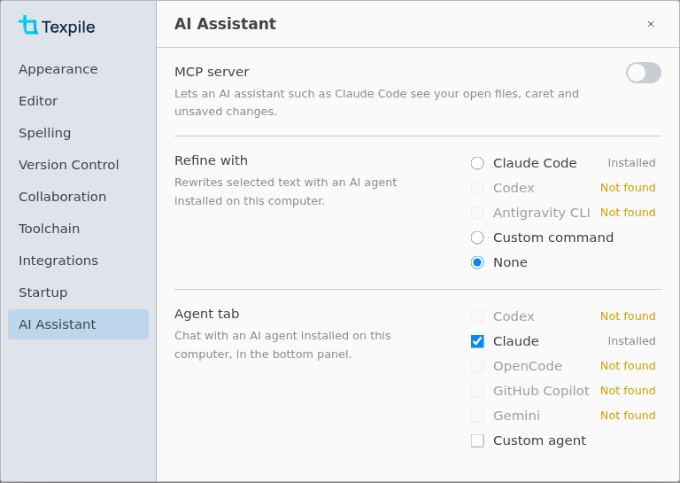

# AI Assistant

Texpile includes no AI. It works with an agent you install and sign in to yourself: chat with it in the [Agent tab](agent-panel.md), rewrite a selection with [Refine](refine.md), or let it read your editor through the [MCP server](mcp.md). Desktop app only.

## Set up an agent

Install the agent and sign in outside Texpile, then pick it in `Preferences › AI Assistant`. The Agent tab and Refine each have their own choice.

| Agent           | Agent tab | Refine | Sign in from a terminal |
| --------------- | --------- | ------ | ----------------------- |
| Codex           | Yes       | Yes    | `codex login`           |
| Claude Code     | Yes       | Yes    | Run `claude`            |
| OpenCode        | Yes       | No     | `opencode auth login`   |
| GitHub Copilot  | Yes       | No     | Run `copilot`           |
| Gemini          | Yes       | No     | Run `gemini`            |
| Antigravity CLI | No        | Yes    | Its own sign-in (`agy`) |

You can also enter your own command. For the Agent tab it must speak the Agent Client Protocol, such as `opencode acp`. For Refine it reads a request and prints the new text, such as `ollama run llama3.1`.

**Not found** means Texpile cannot find the agent. Add its folder in `Preferences › Toolchain › Folders`, then reopen Preferences.

What each feature sends is in [Privacy](../reference/privacy.md).
