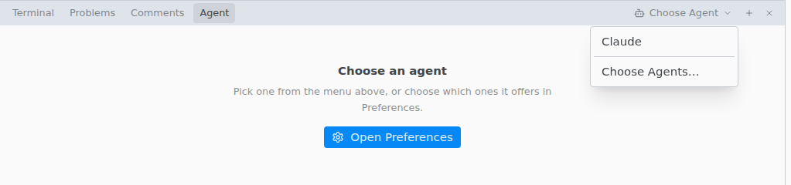

# Agent tab

Chat with an AI agent that reads and edits files in the open folder and runs commands there. Pick an agent from the menu at the right end of the bottom panel's tabs.

> [!REQUIRES] an [AI agent](README.md#set-up-an-agent) installed outside Texpile

- The open file, or the selected lines, go with each message. Click **Leave out of the message** to send without them.
- Paste or drop an image (PNG, JPEG, GIF or WebP) if the agent takes images.
- Type `/` at the start of the box for the agent's own commands. A command runs only when the message holds nothing else.
- Changing folder starts a new chat.

## Review and revert

When a turn ends, **Changed by {agent}** lists the changed files, including changes from commands the agent ran. Click a file to see its changes in the editor. **Revert Change** undoes one change. **Revert to Before {agent}**, in the row's menu, undoes the whole file.

Files over 1 MB and binary files cannot be reverted. Revert works until you close the window.

## Messages

| You see                  | Fix                                                                                        |
| ------------------------ | ------------------------------------------------------------------------------------------ |
| {agent} is not signed in | Run the command shown in a terminal. **Open Terminal** opens one.                          |
| {agent} was not found    | Install it, or add its folder in `Preferences › Toolchain › Folders`. Click **Try Again**. |
| {agent} stopped          | The note shows its last message. Click **Try Again**.                                      |
