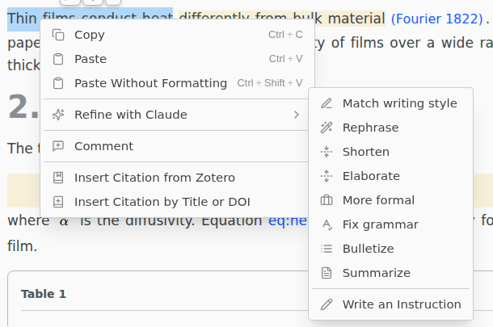

# Refine selected text

Rewrite a selection with an AI agent. The result arrives as a [suggestion](../comments/suggesting.md) under the agent's name, so nothing changes until you accept it.

> [!REQUIRES] an [AI agent](README.md#set-up-an-agent) installed outside Texpile

Select text, then right-click › **Refine with {agent}** and pick an action. With **Toolbar on selection** on in `Preferences › Editor`, the selection toolbar also has a Refine button.

**Match writing style** rewrites the passage to match the text around it. **Write an Instruction** does what you type.

Works in LaTeX, Typst, Markdown, BibTeX and plain text. Not available to guests, while you host a shared session, when you open a single file without its folder, or in the web version. The agent also gets the text around the selection: see [Privacy](../reference/privacy.md).

If you see "The text from {agent} was not used", the result broke a rule, and the note names it. In LaTeX, a result is not used if it cites a key your bibliography does not have or removes a `\label`.
