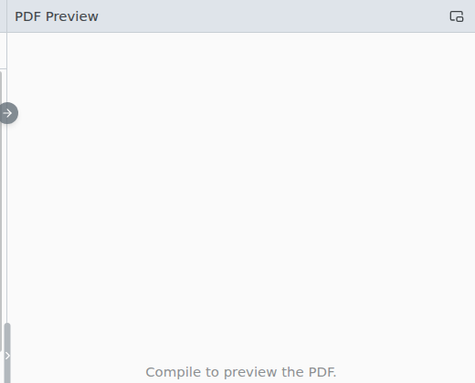

# PDF and preview pane

The compiled PDF beside the editor. The small button on the divider opens and closes the pane.

- The "…" menu holds **Rotate**, **Invert page colors**, **Simulate color vision**, **Presentation mode** and **Save PDF**.
- **Invert page colors** changes the screen only. The dark and light themes each remember their own choice.
- In presentation mode, click for the next page and Shift click or right-click for the previous one.
- The pop-out button moves the pane to its own window.

## Color vision check

The eye button, or "…" › **Simulate color vision**, shows the page as seen with protanopia, deuteranopia, tritanopia or achromatopsia. Only the screen changes, never the PDF. Works in the PDF pane, the LaTeX live preview and the Typst preview.

## A PDF built outside Texpile

A PDF built by another program, for example `latexmk -pvc` or an agent, reloads on its own when it is newer than the one on screen. If your build writes elsewhere, set its path in the compile settings under **Advanced: Output Paths**.
