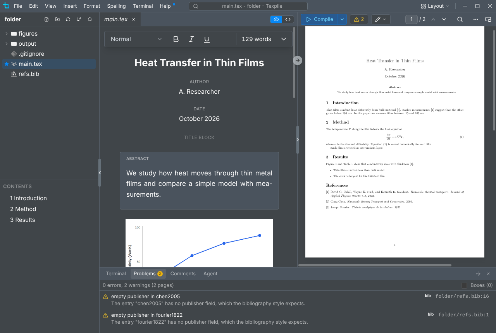

# Problems

The errors and warnings from the last build, with the file and line. Click a row to jump there.

- The panel opens after a compile with errors, unless **Open terminal panel when compiling** is off in Preferences › Editor. The badge left of Compile shows the counts.
- **bib** marks a bibliography message. A bibliography warning that names an entry jumps to that entry in the `.bib` file.
- For Typst, the panel updates as you type while **Preview** is on. Otherwise it shows the last compile.
