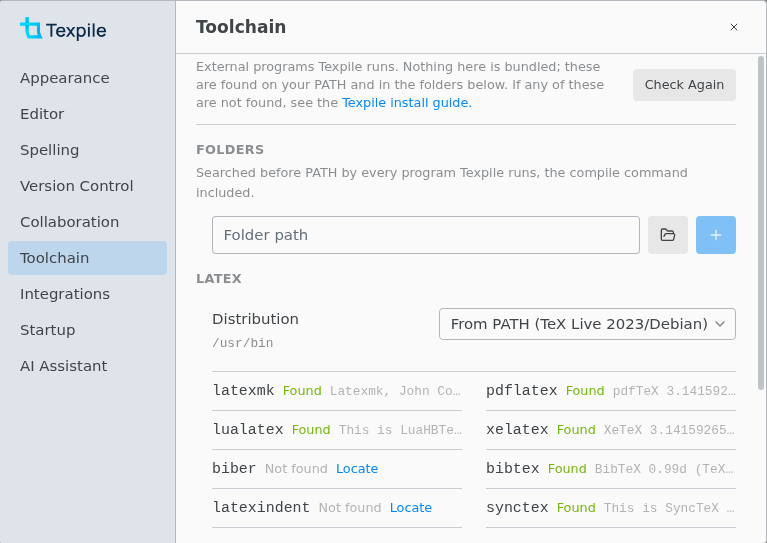
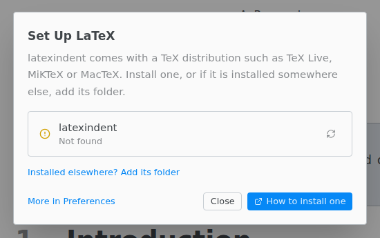
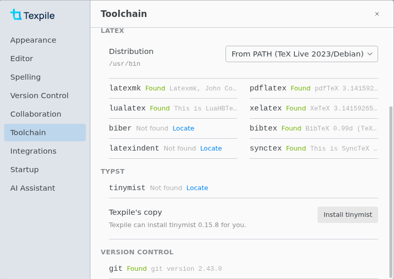

# Toolchain

**File › Preferences… › Toolchain** shows which programs Texpile found and where it looks for them.

Only the programs your commands call are needed. The default compile command needs latexmk and lualatex. Live preview needs lualatex, **Format Document** needs latexindent, and jumping between the text and the PDF needs synctex.

Texpile reads your PATH once, when it starts: restart it after you change PATH. Folders you add here apply at once.

## The Set Up dialog

**Set Up LaTeX** or **Set Up Typst** opens when a compile, a jump, Format Document or the live preview needs a program Texpile cannot find.

- **Installed elsewhere? Add its folder** adds the folder to **Folders**.
- **How to install one** opens the [TeX install guide](../installation/latex/README.md).
- If TeX Live or MiKTeX is installed but lacks the program, the dialog says so. Add the program with that distribution's package manager.

## Folders and distribution

Texpile searches **Folders** before PATH, for every program it runs, including your compile command. **Locate** on a **Not found** row adds the program's folder.

With more than one TeX Live or MiKTeX installed, pick one under **Distribution** to put its folder first. **From PATH** uses your PATH.

## Install tinymist for Typst

**Install tinymist** is in the Typst section, the **Set Up Typst** dialog, and the "tinymist is not installed." bar above a `.typ` file.

A tinymist on PATH or in **Folders** comes first. To use Texpile's copy, pick **Texpile's copy** under **Distribution**.

If Texpile's copy cannot run on your computer, [install tinymist yourself](../installation/typst/README.md).
