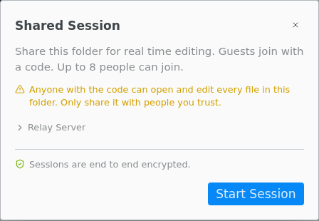
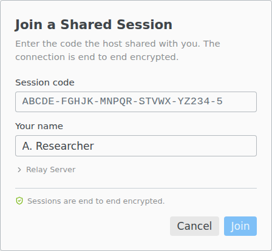

# Real-time collaboration

Edit a folder with other people at the same time. Guests join with a code, in Texpile or in a browser, with no account.

> [!REQUIRES] an internet connection

## Host a session

Open a folder in the desktop app, choose `File › Shared Session`, click **Start Session**, and send guests the link or the code. The web version, or a single file opened on its own, cannot host.

- Click the guest avatars in the title bar to reopen the dialog. **End Session** stops the code for everyone. Closing the folder or window, or reloading, also ends it.
- Leave the **Relay Server** address as it is unless someone gave you another one. If you change it, guests must enter the same address and join with the code, not the link.
- Only you compile, with the programs on your computer. Guests see the PDF and the problems.
- During a session, shell escape is off and LaTeX live preview is off. Typst preview is shown to guests, who need no Typst installed.
- Guest edits, new files, renames and deletes are written into your folder. Deleted files go to your trash.

## Join a session

On the start screen, click **Join Session** and enter the code (or the whole link) and your name. A link opened in a browser offers **Open in the Texpile App**, or **Join Here** to join in the browser with nothing to install.

The portable version of Texpile does not open session links. Enter the code on its start screen.

If your connection drops, Texpile keeps trying and merges your edits, including offline edits, when it is back. **Leave** keeps the session running for the others.

## What is shared

Guests see the compiled PDF, the compile problems, the comments, and every file up to 100 MB except those whose names start with a dot, such as `.git` and `.texpile`. Text files over 2 MB are view only. A session holds up to 8 guests, all on Texpile 1.2.0 or newer.

## What guests cannot do

Guests cannot compile (**Request Compile** in the top bar asks the host), save (the host's machine does), or use Source Control, Format Document, search in files, the terminal, the Agent tab, Refine, Zotero, Cite by title or DOI, or Version History.

## Anyone with the code can edit

- There is no account, password or approval. Anyone with the code or the link can open and edit every shared file. Guests cannot be made read only.
- You cannot remove one person. End the session and start a new one: it gets a new code.
- Names are not checked. Comments carry whatever name a guest typed.
- Sessions are end to end encrypted. Texpile's server sees that a session exists, how many guests are in it, when messages are sent and how big they are, and network addresses. It cannot read files, names, cursors or comments.
