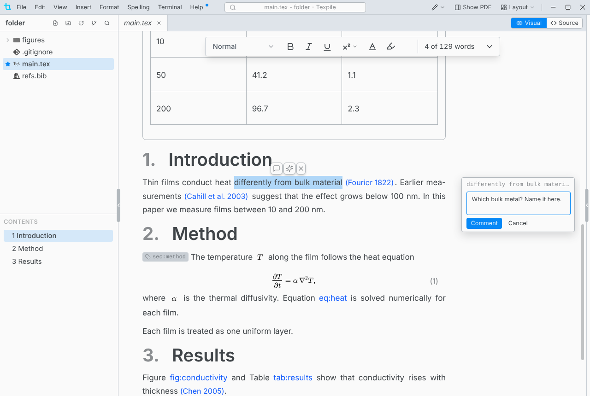
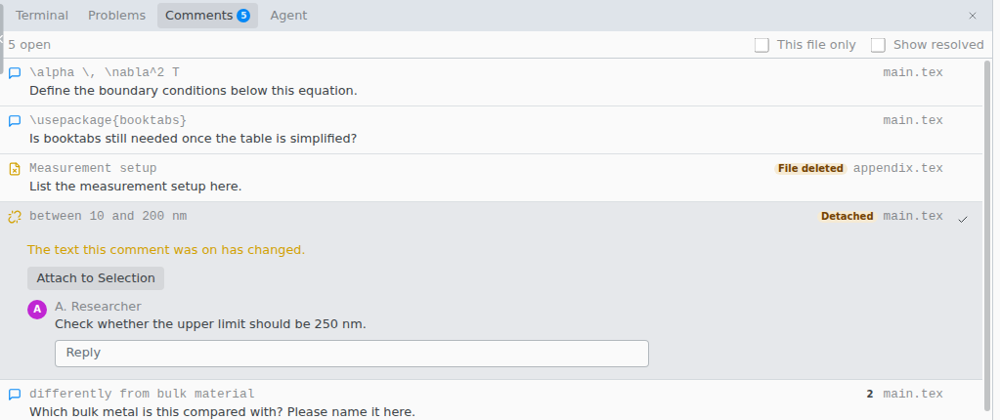

# Comments

Comments work as in Google Docs: select text, then right-click › **Comment**. They also work in the source editor.

Every comment in the project is listed in the **Comments** tab of the bottom panel. Resolved threads show there only with **Show resolved** ticked.

## How comments differ

- Anyone can edit or delete any message, not only their own.
- Deleting the commented text deletes its comment. Undo brings both back.
- In the source editor the commented text is highlighted and its line number is marked. Click the mark to open the comment.
- Comments are kept in the hidden `.texpile` folder of the project, not in your file, and never appear in the PDF. Commit `.texpile` so others get them.
- Comments need the whole folder open, not a single file on its own.

## When a comment loses its place

Texpile follows only edits made in Texpile. A comment whose words it cannot find gets a badge in the Comments tab.

| You see              | Fix                                                                                                                    |
| -------------------- | ---------------------------------------------------------------------------------------------------------------------- |
| **Detached**         | The words changed, often in another program. Select the right text, open the thread and click **Attach to Selection**. |
| **File deleted**     | Restore the file. Renaming or moving a file in Texpile keeps its comments.                                             |
| **Not in this view** | Nothing is wrong. The visual editor does not show this text, such as the preamble. Switch to **Source**.               |
| **Check placement**  | The sentence appears more than once. Check which copy the comment is on.                                               |
