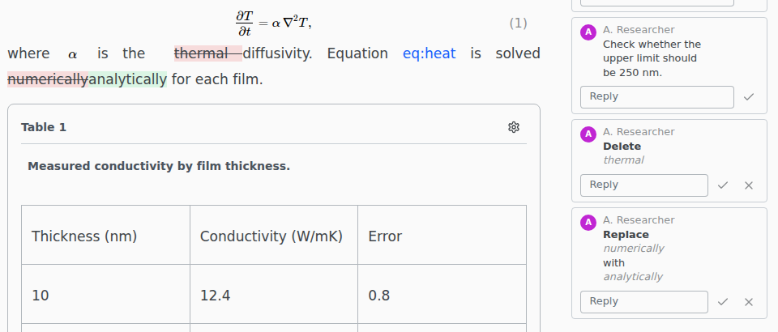

# Suggesting changes

Suggesting mode works as in Google Docs: your edits become suggestions that someone accepts or rejects. Switch with the pencil button in the top bar. Texpile remembers the mode per project.

## Suggestions in source files

Your file already holds the suggested text, so the PDF shows every suggestion as if accepted. The old words are kept in the hidden `.texpile` folder until someone accepts or rejects them. Commit `.texpile` with the file.

In the source editor, spaces and line breaks are suggested like any other text. The visual editor suggests only paragraph breaks.

## Accept or reject

Accept or reject each suggestion on its card. There is no Accept All or Reject All.

- Suggestions cover whole words. Fixing a typo replaces the word.
- In Editing mode, typing inside a suggestion splits it around your words, and replacing all of it closes it as **Closed by an edit**.
- [Refine](../ai-assistant/refine.md) and AI assistants connected over MCP leave suggestions under their own name.
- Suggesting needs the whole folder open, not a single file on its own.

## Changes the visual editor cannot show

A change in a formula, a table or LaTeX commands shows as a yellow paragraph with **Some changes cannot be shown here**. A change in the preamble or a `%` comment shows only in the Comments tab, as **Not in this view**. Switch to **Source** to review either.
