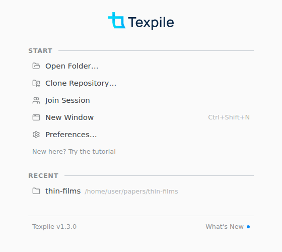
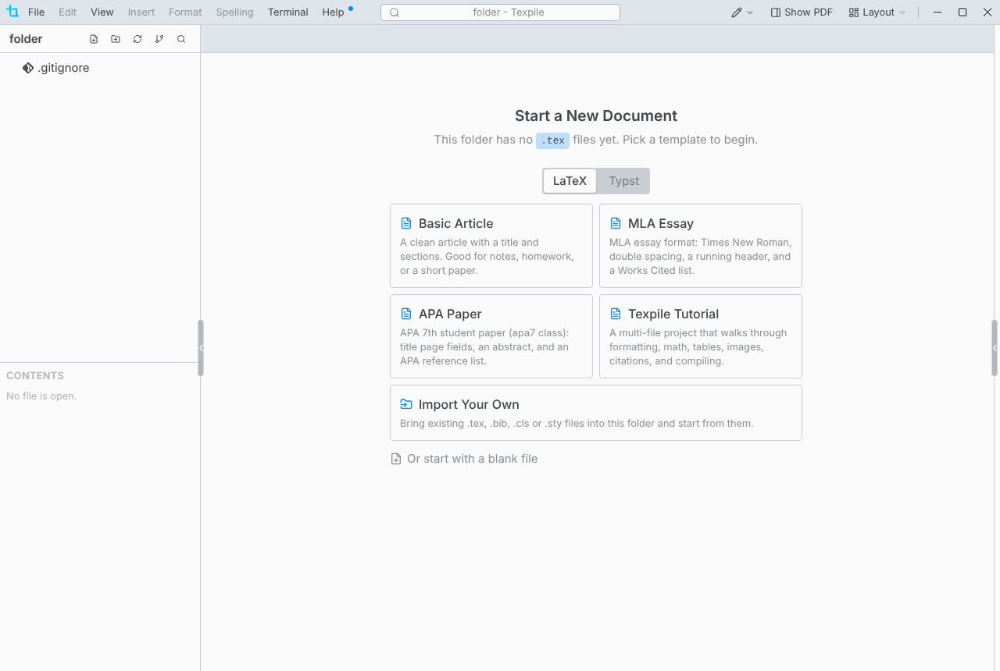

# Getting started

Open a folder, start a document from a template, and compile it to a PDF.

## Open a folder

Click **Open Folder…** on the start screen, or press Ctrl O (Cmd O on macOS). **New here? Try the tutorial** builds a multi-file example in an empty folder you pick.

Texpile reopens your folders at the next launch, each on its last file.

## Start a document

In an empty folder, **Start a New Document** offers LaTeX and Typst templates. Click one and Texpile copies its files into the folder.

**Browse Typst Templates…** adds community templates from Typst Universe. File › Save as Template… turns a folder of your own into a template under **Your Templates**.

Markdown has no compile step: File › New › Markdown File.

## Compile

Press Ctrl Alt Enter, or **Compile** at the top of the PDF (**Show PDF** in the title bar opens it). The PDF and build files go into an `output` folder next to the main file.

With several documents and no main file set, Texpile asks once which one to compile. To change it, right-click a file and choose **Set as Main File**.
