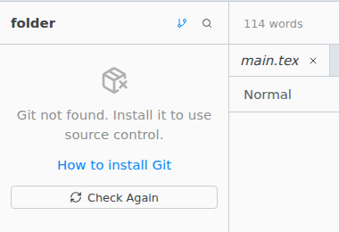

# Git

Install git to use Source Control and to clone projects.

| System         | Command                                          |
| -------------- | ------------------------------------------------ |
| Windows        | `winget install --id Git.Git -e --source winget` |
| macOS          | `xcode-select --install`, or `brew install git`  |
| Debian, Ubuntu | `sudo apt install git`                           |
| Fedora         | `sudo dnf install git`                           |
| Arch           | `sudo pacman -S git`                             |

On Windows, the installer from [git-scm.com](https://git-scm.com/download/win) works too. Then click **Check Again**.
