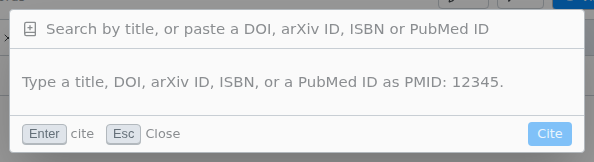

# Cite by title or DOI

Find a paper online and add it to your bibliography, with the citation in place. Works in LaTeX and Typst, with a main file set.

> [!REQUIRES] an internet connection

Right-click in the editor › **Insert Citation by Title or DOI**, then type a title or paste an ID.

- IDs: a DOI, arXiv ID, ISBN or PubMed ID (`PMID: 12345`), or a doi.org, publisher, arxiv.org or PubMed link.
- A title gives up to eight papers. Add an author's surname or a year to narrow it.
- A paper already in your bibliography is cited by its existing key.
- The reference goes into the same `.bib` file as [Zotero](zotero.md#which-bib-file) uses.
- Only the host of a shared session can use it.

If you see "The registry for this DOI does not give out citation data.", cite the paper another way, such as from [Zotero](zotero.md). "Could not reach {service}" means you are offline or a proxy blocks the request.
