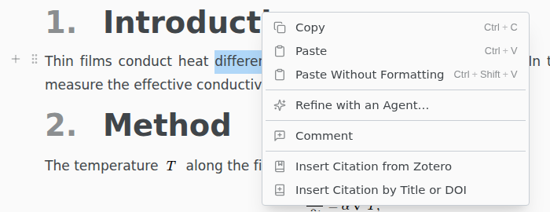

# Zotero

Insert citations from your Zotero library into a LaTeX or Typst document.

> [!REQUIRES] Zotero with [Better BibTeX](https://retorque.re/zotero-better-bibtex/installation/)

## Cite

Keep Zotero running and set a main file. Each reference needs a citation key.

Right-click in the editor › **Insert Citation from Zotero**, tick one or more references, and click **Insert**. Texpile inserts `\cite{key1,key2}` or `@key1 @key2` and copies the references into your bibliography.

Only the Zotero library on your computer is searched. Group libraries that have not synced do not show.

## Which .bib file

New references go into the `.bib` file your main file names. If it names none, Texpile uses `references.bib` or the first `.bib` file in the project, or creates `references.bib` next to the main file. Then add the bibliography command to your main file yourself.

A reference already in the bibliography is not added again, even if it changed in Zotero. To update it, delete the entry from the `.bib` file and insert it again.
