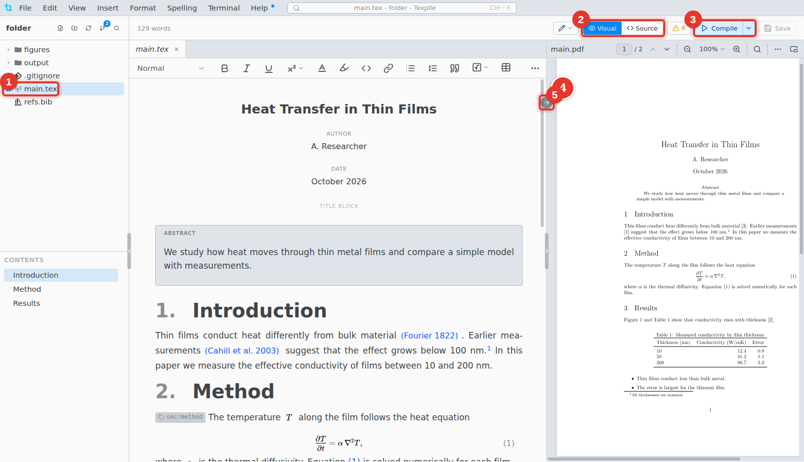

# LaTeX

Write LaTeX in the visual editor or as source, and compile it to a PDF.

1. **Main file.** The star marks the file Texpile compiles.
2. **Visual / Source.** Switch editors at any time. Both edit the same file.
3. **Compile.** Builds the PDF.
4. **PDF.** The compiled PDF. The bar on the right edge of the editor shows and hides it.
5. **Jump to PDF.** Shows the cursor's place in the PDF. Double-click the PDF to jump back.

## The main file

The main file is the one with `\documentclass` and `\begin{document}`. In a folder with several `.tex` files, Texpile asks once which one it is. To change it, right-click a file and choose **Set as Main File**.

## Folders Texpile adds

The PDF and the build files go in an `output` folder. Your comments and compile settings are in `.texpile`: keep it with the project.
