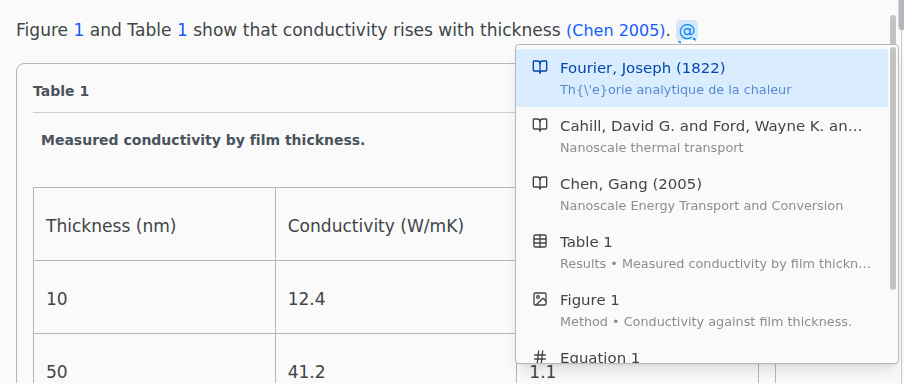
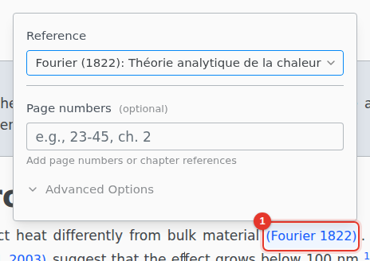
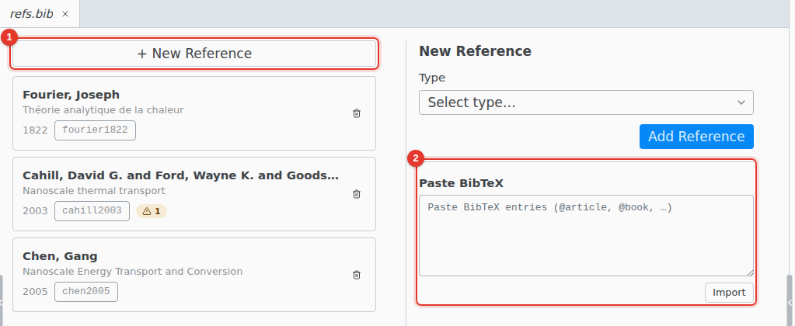

# Citations and references

Type @ to cite a work or to reference a figure, table, equation or section.

The list holds the entries of your `.bib` files and every labeled figure, table, numbered equation and section. Type part of a key, author, title or year to narrow it.

## Edit a citation

Click a citation to change the work or add page numbers. **Advanced Options** adds a prefix such as "see" and changes the citation style: `\parencite` and `\textcite` with biblatex, `\citep` and `\citet` with natbib.

## Cross-references

Click a `\ref` or `\eqref` to jump to what it points to.

`\cref`, `\Cref`, `\autoref`, `\pageref` and `\nameref` open a panel instead, where **Shows as** switches the command. It offers only the commands your preamble supports:

| Shows as              | Command    | Needs      |
| --------------------- | ---------- | ---------- |
| Number                | `\ref`     |            |
| Number in parentheses | `\eqref`   | `amsmath`  |
| Page number           | `\pageref` |            |
| Name and number       | `\cref`    | `cleveref` |
| Sentence start        | `\Cref`    | `cleveref` |
| Full name and number  | `\autoref` | `hyperref` |
| Title                 | `\nameref` | `hyperref` |

## Your bibliography

Open a `.bib` file to edit it as a list of entries.

1. **New Reference** adds an entry with a form.
2. **Paste BibTeX** imports entries copied from a publisher's site or Google Scholar.

To cite from Zotero or find a paper by its title or DOI, see [Zotero](../integrations/zotero.md) and [Cite by DOI](../integrations/cite-by-doi.md).
