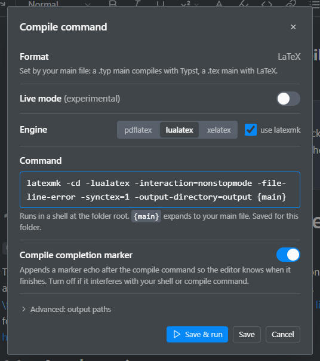
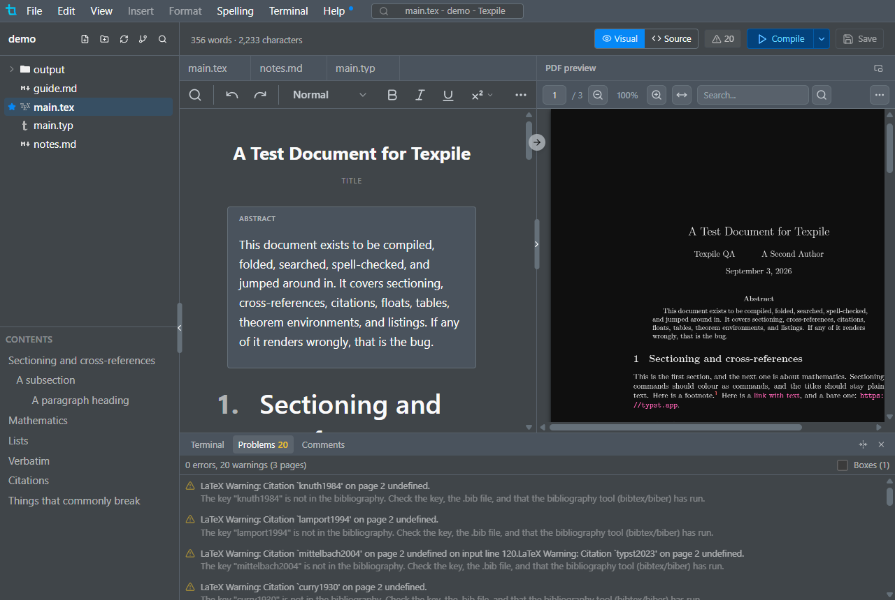
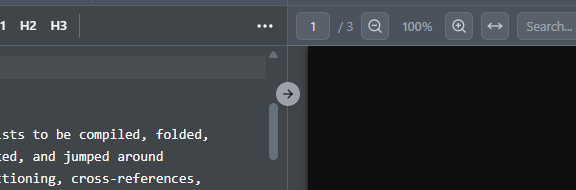

# Compiling

Texpile runs the compile command you choose, on your computer, and shows what came back.

| Where to find it | Path                                  | Note                                           |
| ---------------- | ------------------------------------- | ---------------------------------------------- |
| Menu             | Terminal › Compile                    |                                                |
| Menu             | Terminal › Configure compile command… | The command, the engine, and live mode.        |
| Menu             | Terminal › New terminal               | Opens another shell alongside the running one. |
| Shortcut         | Ctrl+Alt+Enter                        | Start or stop a compile.                       |
| Panel            | Problems                              | In the dock at the bottom of the window.       |

> [!NOTE]
> Compiling needs a TeX distribution: TeX Live, MiKTeX, or MacTeX. Editing works without one.

## The command

Terminal › Configure compile command… sets what runs. Any shell command works, `{main}` expands to your main file, and the command is saved per folder. Use default puts the default back. Under Advanced: output paths you can name the PDF and log file yourself, for a custom `-jobname` or an unusual output layout.

```bash
latexmk -pdf {main}
```



## Problems panel

Errors and warnings from the compile and bibliography logs, in plain language. Click one to jump to its line. Open the panel from the Problems tab in the dock, or from the badge beside the Visual / Source toggle.



## SyncTeX

In the source editor, right-click a line and choose Show in PDF, or click the arrow button at the top of the divider between the editor and the PDF. Double-click text in the PDF to jump back to the source.



## Terminal

Compiles run in a terminal named Compile in the dock. Terminal › New terminal opens another shell beside it.
