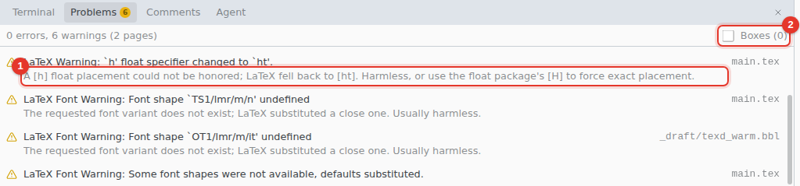
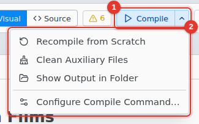
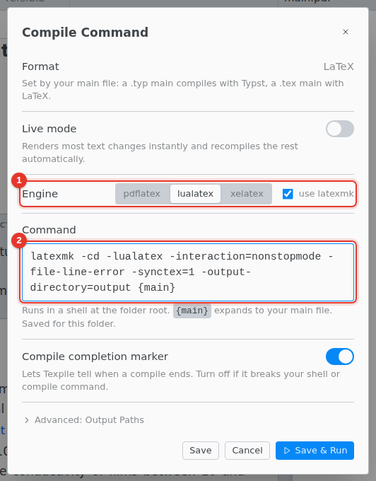

# Compiling

Press **Compile**, or Ctrl Alt Enter, to build the PDF from the main file. Texpile saves your files first, and the PDF opens beside the editor.

## Problems



Errors and warnings from the log, with the file and line. Click a row to jump there. The count also shows next to Compile.

1. **Hints.** Common messages get a plain-words hint, such as the `\usepackage` line an unknown command needs.
2. **Boxes** adds overfull and underfull box warnings.

## Jump between the source and the PDF

The arrow on the divider between the editor and the PDF shows the cursor's place in the PDF. In the source editor, right-click › **Show in PDF** does the same. Double-click the PDF to jump back.

## Change the engine or the command

Open the menu next to Compile.



1. The menu.
2. **Recompile from Scratch** deletes the build files and compiles again. Use it when an error stays after you fixed it. **Clean Auxiliary Files** deletes the build files and keeps the PDF.

**Configure Compile Command…** opens the settings:



1. **Engine.** pdflatex, lualatex or xelatex. With **use latexmk** on, the compile repeats until the references and citations settle.
2. **Command.** Write your own. `{main}` stands for the main file. **Use Default** puts the default back.

The settings are saved for the folder.

## Shell escape

Packages such as `minted` need `-shell-escape` in the command. It is refused while you host a shared session.

## A project with its own command

A project that sets its own compile command, such as one you cloned, shows "This project is set up to compile with:" above the editor. Compile waits until you click **Use It** or save your own command.

## The default command

```bash
latexmk -cd -lualatex -interaction=nonstopmode -file-line-error -synctex=1 -output-directory=output {main}
```

| Part                       | What it does                                               |
| -------------------------- | ---------------------------------------------------------- |
| `-cd`                      | Runs in the main file's folder, so its includes are found. |
| `-lualatex`                | The engine. `-pdf` is pdflatex and `-xelatex` is xelatex.  |
| `-synctex=1`               | Lets you jump between the source and the PDF. Keep it.     |
| `-output-directory=output` | Puts the PDF, the log and the build files in `output`.     |
