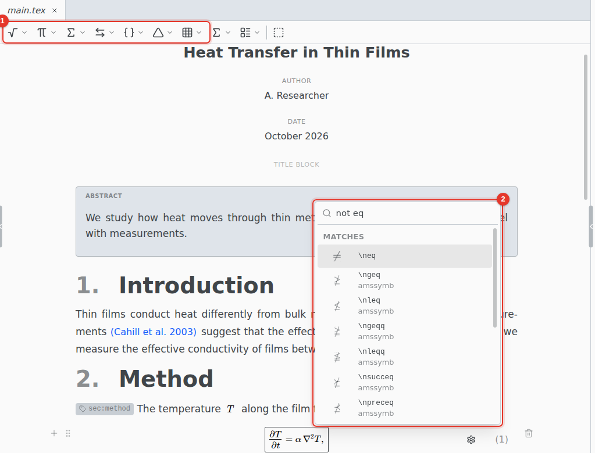
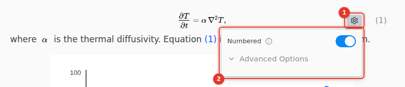
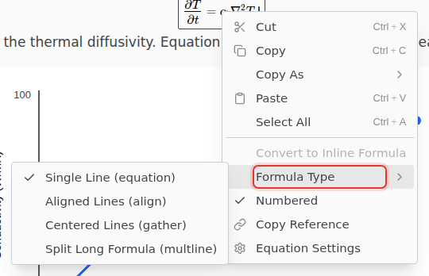

# Equations

Type math as you would in LaTeX and see it typeset as you go.

1. **Math toolbar.** Shows while the cursor is in an equation: Greek letters, operators, arrows, brackets, matrices and environments.
2. **Symbol search.** Press Tab in an equation and type a name or what the symbol means, such as `not eq` or `arrow right`.

## Insert an equation

Press Ctrl M for an inline equation, or Ctrl Shift M for a display equation.

Type a command and press Space: `\frac` becomes a fraction with places to fill. Your own `\newcommand` macros show as they print.

If a symbol needs a package your document does not load yet, click **Add to Preamble**.

## Number and label

1. Hover a display equation and click its settings icon.
2. Turn on **Numbered**.

Type @ anywhere to reference the equation. Its label is under **Advanced Options**: rename it and every reference follows. In an equation of several lines, each line has its own label.

## Change the formula type

Right-click an equation for **Formula Type**: Single Line (`equation`), Aligned Lines (`align`), Centered Lines (`gather`) or Split Long Formula (`multline`).

The same menu converts between inline and display, and **Copy As** copies the equation as LaTeX, Typst or MathML.

## Keyboard shortcuts

On macOS, use Cmd for Ctrl.

| Shortcut     | Action                                     |
| ------------ | ------------------------------------------ |
| Ctrl M       | Inline equation                            |
| Ctrl Shift M | Display equation                           |
| Tab          | Symbol search, inside an equation          |
| Shift Enter  | A new equation below, inside a display one |
