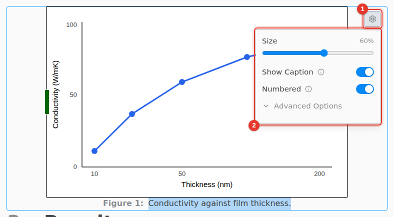

# Figures and images

Drag an image onto the editor, paste one, or use Insert › Image…. PNG, JPEG, GIF and WebP work. A pasted picture is saved in an `images` folder next to the file.

1. Select the image and click its settings icon.
2. Set the **Size**, and turn on **Show Caption** and **Numbered**.

Type @ anywhere to reference a numbered figure. Drag the handles of a selected image to resize it.

A PDF figure shows its first page. An image from a web address does not show: save it in the project instead.
