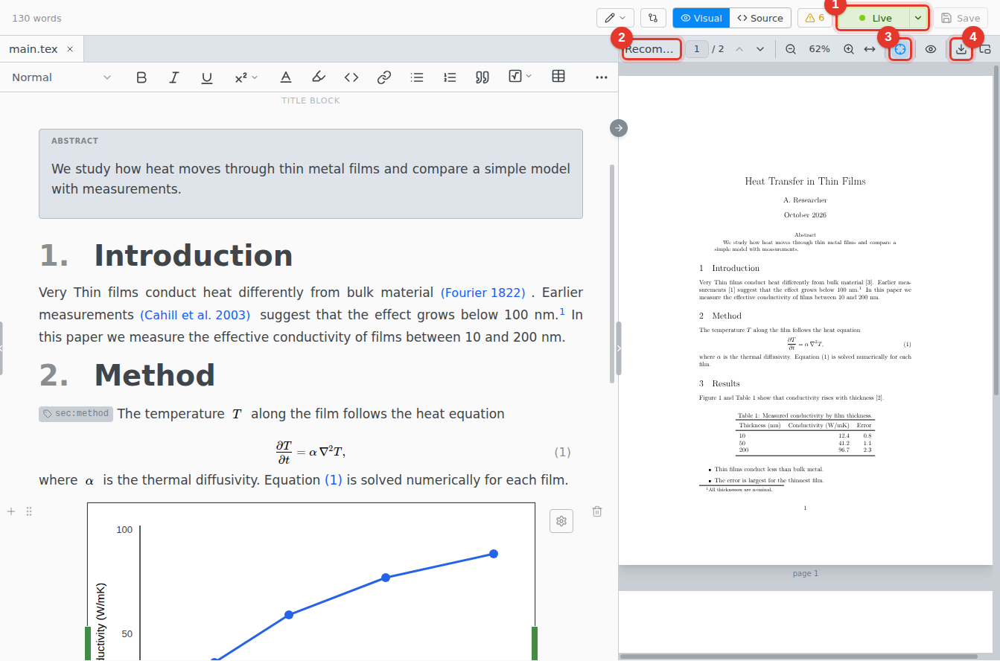
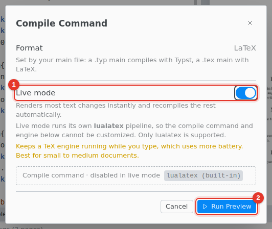

# Live preview

The PDF updates as you type. Most edits show in a fraction of a second.

1. **Live.** Click to pause. **Paused** resumes.
2. **Status.** What the preview did last, such as an instant update to one page or a full recompile.
3. **Follow edits.** Scrolls the PDF to where you type.
4. **Save PDF.** Compiles the whole document and saves the PDF.

## Turn it on

Open the menu next to Compile and choose **Configure Compile Command…**.

1. Turn on **Live mode**.
2. Click **Run Preview**.

Live mode is saved for the folder. Close the PDF pane to stop the preview.

## Limits

- **lualatex only.** A document that needs pdflatex or xelatex fails here. Use Compile.
- **No shell escape.** Packages such as `minted` do not build here. Use Compile.
- **Not while you host a shared session.** Guests see the compiled PDF.
- **One window at a time.** **Use Live Preview Here** moves it to the window you are in.
- **Battery.** The engine runs while you type. It stops after 10 minutes without use.
