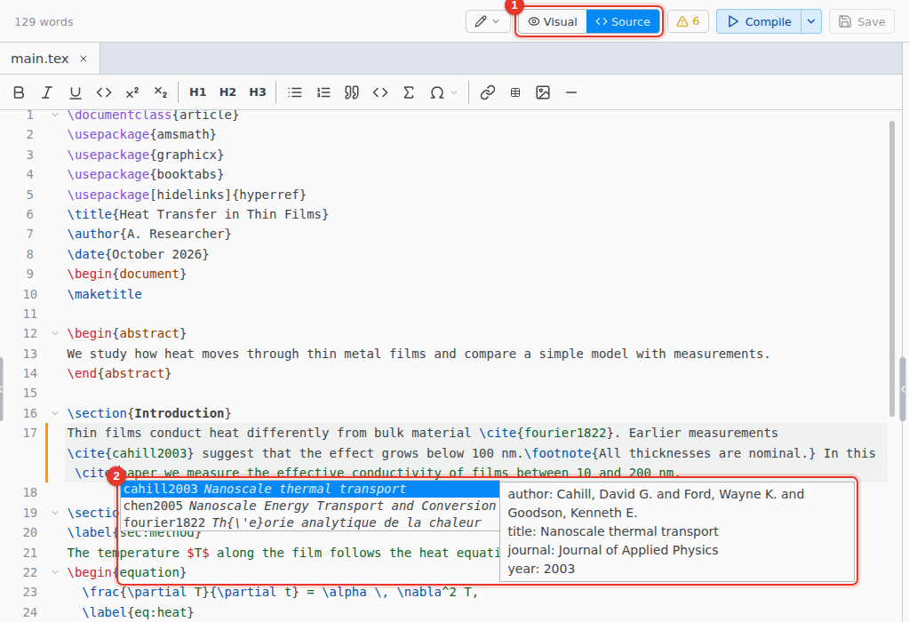
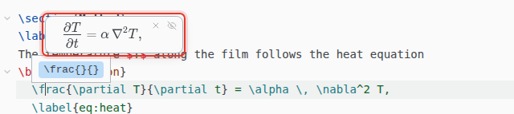

# Source editor

Edit the LaTeX directly. Commands, labels, citation keys and file names complete from your whole project.

1. **Source.** Switch to the source editor.
2. **Completion.** Opens as you type. Ctrl Space opens it any time.

Completion covers commands (your own `\newcommand` macros too), environments, packages, labels, citation keys and file names. In `\cite{`, search by key, title or author. Type `@` and a letter for a symbol: `@a` offers `\alpha`.

## Go to definition and hover

F12, or Ctrl Click, on a label, a citation key, one of your own commands, or a file in `\input` opens where it is defined.

Hovering shows the citation's entry, the image of an `\includegraphics`, or the typeset equation a `\ref` points to.

## Math preview

The equation under the cursor shows typeset above it. Esc hides it.

## Symbols

Insert › Symbol… finds a symbol by command (`subsetneq`), by meaning (`not equal`) or by package. It shows the `\usepackage` line the symbol needs and offers to add it.

## Format Document

Format › Format Document tidies the indentation. Only spacing changes.

## Keyboard shortcuts

On macOS, use Cmd for Ctrl. For Vim or Emacs keys, see File › Preferences… › Editor › Keybindings.

| Shortcut      | Action                                          |
| ------------- | ----------------------------------------------- |
| Ctrl Space    | Show suggestions                                |
| F12           | Go to definition                                |
| Ctrl D        | Select the next match                           |
| Ctrl Alt Up   | Add a cursor above                              |
| Ctrl Alt Down | Add a cursor below                              |
| Ctrl B        | `\textbf{}`                                     |
| Ctrl I        | `\textit{}`                                     |
| Ctrl M        | `\( \)`                                         |
| Ctrl Shift M  | `\[ \]`                                         |
| Ctrl Alt 1    | `\section{}`, with 2 and 3 for the levels below |
