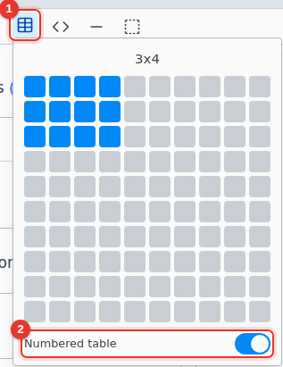
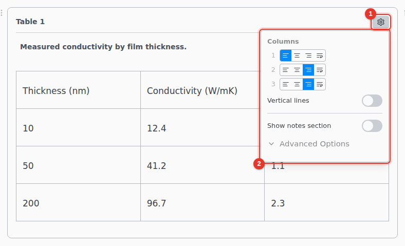

# Tables

Insert a table from the toolbar and edit it like a table in a word processor.

1. **Insert table.** Move over the grid to pick a size, up to 10 by 10.
2. **Numbered table.** A numbered table gets a caption and a label you can reference. Decide before inserting: it cannot be changed later.

## Edit

Tab moves to the next cell. Right-click a cell to add or delete rows and columns. Select several cells and right-click › **Merge Cells**. **Split Cell** undoes it.

A range copied from a spreadsheet pastes as a table.

## Table settings

1. Hover the table and click its settings icon.
2. Set each column, the lines and the notes.

A column can be left, center or right aligned, a paragraph of fixed width, or stretch to fill the line. **Advanced Options** has the table's label and the lines between rows.

A numbered table needs a caption. A warning icon shows until it has one.
