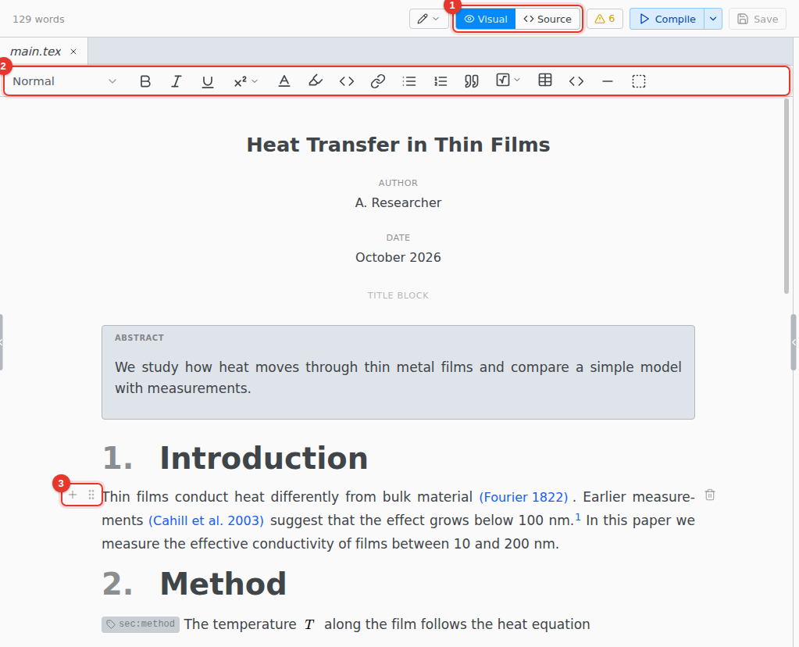
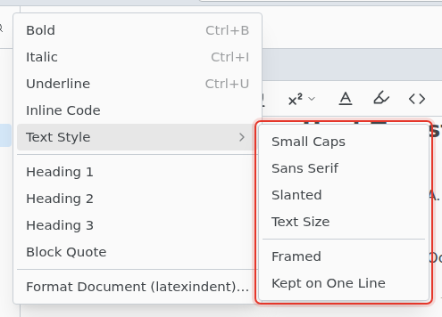
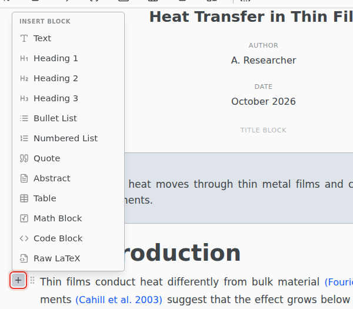

# Visual editor

Edit the document as formatted text. Texpile writes the LaTeX, and the parts you do not touch stay exactly as they were.

1. **Visual / Source.** Switch at any time. Undo works across the switch.
2. **Toolbar.** Headings, text style, lists, math, tables and code. The Insert and Format menus have the rest.
3. **Block handle.** Drag to move the block. **+** adds a block below it.

Click a citation, a label or any other command to edit it.

The visual editor cannot open files over 800 KB. They open in the source editor.

## Headings

The heading menu has Section, Subsection and Subsubsection, each **Numbered** or **Unnumbered** (`\section*`). A `\chapter` or `\part` in the file stays as it is.

## Text style

Format › Text Style adds Small Caps, Sans Serif, Slanted, Text Size, Framed, and Kept on One Line.

## Add a block

Besides text, headings and lists, the menu adds an Abstract, a Table, a Math Block, a Code Block, or Raw LaTeX.

## Anything else

Commands the editor does not draw stay in the file as LaTeX, shown as a chip you can edit. To add your own, use Insert › LaTeX Source:

- **Environment…** adds an environment by name, such as `center`.
- **LaTeX Code** and **Inline LaTeX** add raw LaTeX as a block or inside a line.
- **Comment** adds a `%` comment.

## Paste

Paste from Word, a spreadsheet, a web page or a screenshot, and Texpile keeps what it can. See [Paste and drop](../paste.md).

## Keyboard shortcuts

On macOS, use Cmd for Ctrl.

| Shortcut      | Action              |
| ------------- | ------------------- |
| Ctrl Alt 1    | Section             |
| Ctrl Alt 2    | Subsection          |
| Ctrl Alt 3    | Subsubsection       |
| Ctrl Alt 0    | Normal text         |
| Ctrl M        | Inline equation     |
| Ctrl Shift M  | Display equation    |
| Ctrl .        | Superscript         |
| Ctrl Shift ,  | Subscript           |
| Ctrl Shift B  | Quote               |
| Ctrl Shift \` | Code block          |
| Ctrl Shift V  | Paste as plain text |
