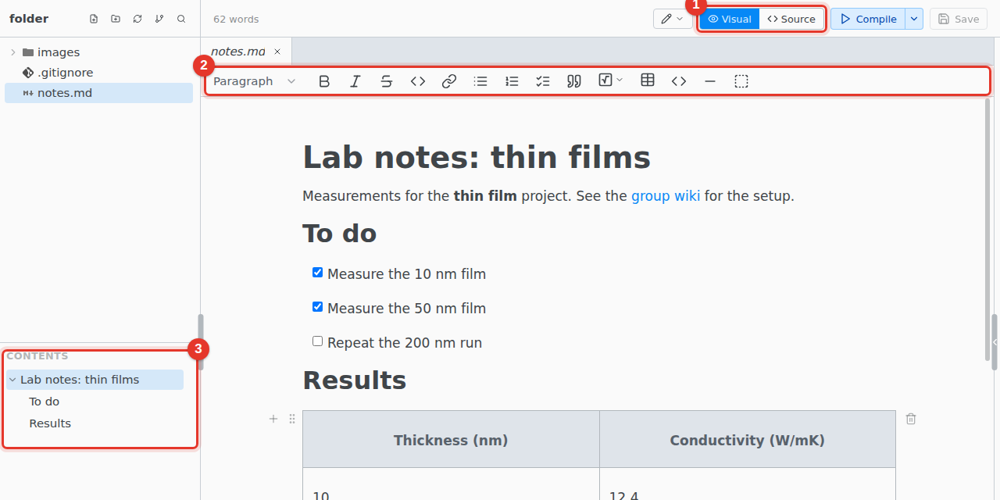

# Markdown

Edit `.md` files visually or as source. The file stays plain Markdown. There is no PDF: the visual editor is the preview.

1. **Visual / Source.** Switch editors at any time.
2. **Toolbar.** Adds strikethrough and task lists. Underline, color, superscript and subscript are not in Markdown.
3. **Contents.** The headings of the file. Click one to go there.

Start a file with File › New › Markdown File.

## Not in Markdown

No citations, cross-references, or equation, figure and table numbers. Comments and suggestions work.
