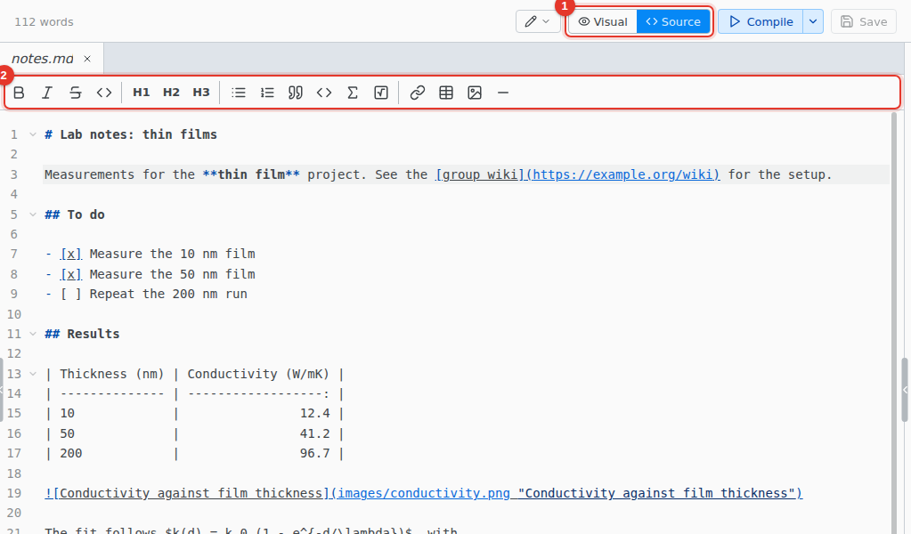

# Source editor

Edit the Markdown directly. The toolbar and the shortcuts write the markup for you.

1. **Source.** Switch to the source editor.
2. **Toolbar.** Bold, italic, strikethrough, headings, lists, math, task lists, links, tables and images.

## Keyboard shortcuts

On macOS, use Cmd for Ctrl. Select text first to wrap it.

| Shortcut      | Action                                        |
| ------------- | --------------------------------------------- |
| Ctrl B        | `**bold**`                                    |
| Ctrl I        | `*italic*`                                    |
| Ctrl Shift X  | `~~strike~~`                                  |
| Ctrl Alt 1    | `#` heading, with 2 to 6 for the levels below |
| Ctrl M        | `$ $`                                         |
| Ctrl D        | Select the next match                         |
| Ctrl Alt Up   | Add a cursor above                            |
| Ctrl Alt Down | Add a cursor below                            |
