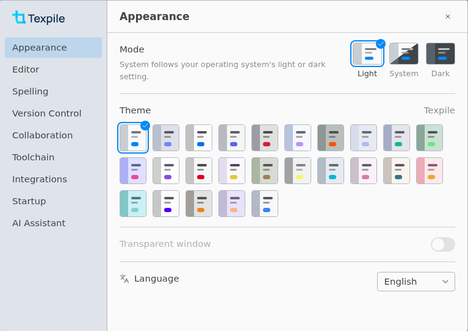

# Preferences

Settings for the whole app. Open it with Ctrl , (Cmd , on macOS) or File › Preferences… (Texpile › Preferences… on macOS).

| Setting                                                  | Note                                                                                                                           |
| -------------------------------------------------------- | ------------------------------------------------------------------------------------------------------------------------------ |
| Appearance › Language                                    | Changes the interface only. Spell check follows each document's own language.                                                  |
| Editor › Keybindings                                     | Vim and Emacs work in the source editor only.                                                                                  |
| Editor › Justify text, Hyphenate words                   | Change the visual editor only, not the compiled document or the file.                                                          |
| Editor › Expand snippets automatically                   | Turns off only the snippets that expand on their own. See [Snippets](snippets.md).                                             |
| Editor › Auto-fraction, Tab out of brackets, Matrix keys | Source editor math only. See [Snippets](snippets.md#math-typing-helpers).                                                      |
| Spelling › Check spelling and grammar                    | Off by default.                                                                                                                |
| Spelling › This folder › Language                        | The same choice as Spelling › Folder Language. Needs an open folder.                                                           |
| Spelling › Default language                              | For documents that name no language, in folders set to Automatic. English by default.                                          |
| Spelling › Custom Dictionary                             | One list per language. Separate several words with spaces, commas, or semicolons.                                              |
| Spelling › Grammar rules                                 | All off by default. Shown while English is the default language or the open folder is checked in English.                      |
| Version Control › Autofetch                              | Fetches from the default remote every 3 minutes.                                                                               |
| Version Control › Git Identity                           | Read-only. Change it with `git config` in a terminal.                                                                          |
| Version Control › Keep version history                   | Keeps a copy of each save for 30 days.                                                                                         |
| Collaboration › Display name                             | Shown in shared sessions and on your comments. Left empty, you show as Host or Guest.                                          |
| Toolchain › Folders                                      | Texpile looks here first for every program it runs, your compile command too. See [Toolchain](build-and-preview/toolchain.md). |
| Toolchain › Distribution                                 | Which TeX distribution, and which tinymist, to use when more than one is found.                                                |
| Integrations › Find and cite papers online               | Looks papers up through Crossref, DataCite, doi.org, Open Library, and PubMed.                                                 |
| AI Assistant › MCP server                                | Lets an AI assistant such as Claude Code see your open files. See [MCP server](ai-assistant/mcp.md).                           |
| AI Assistant › Refine with                               | An agent Texpile cannot find cannot be picked. Add its folder under Toolchain › Folders.                                       |
| AI Assistant › Agent tab                                 | Untick every agent to remove the tab.                                                                                          |

## Not in Preferences

- The compile command, output paths, and live mode are saved per folder: Terminal › Configure Compile Command….
- Interface zoom: View › Zoom In, Zoom Out, Reset Zoom.
- Which panels show, and how the editor and the PDF are split: Layout in the title bar.
- Dark PDF pages: **Invert colors** in the PDF bar's "…" menu, remembered separately for light and dark mode.
