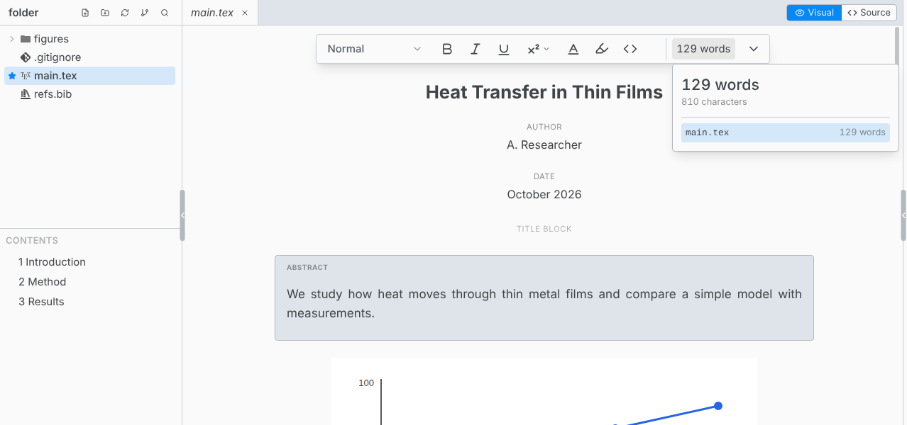
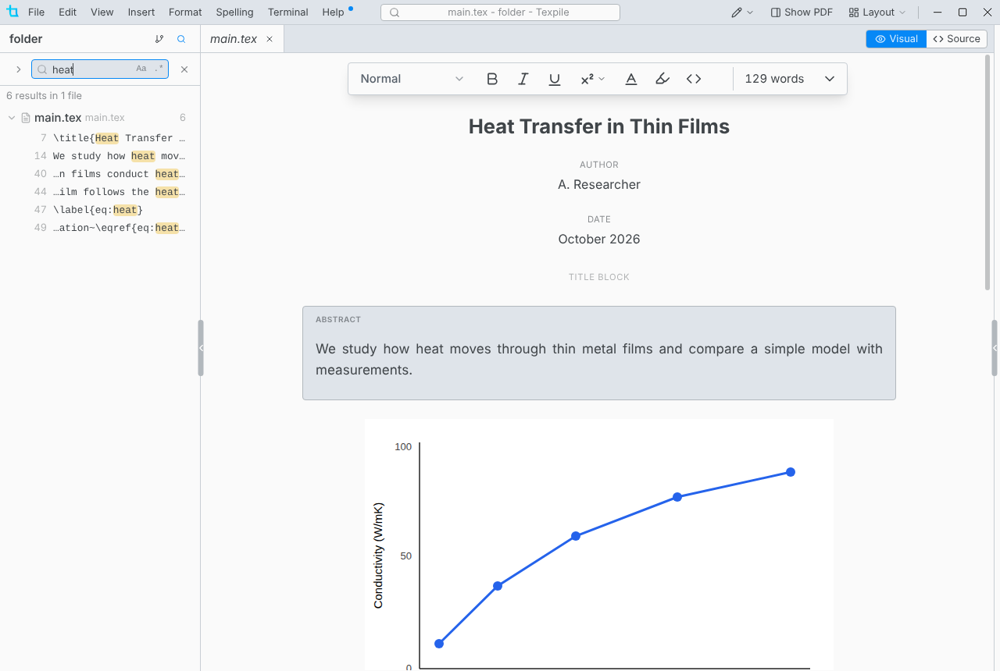

# Projects and files

A project is a folder. There is no project file to create. A folder opens in one window at a time.

## The main file

The main file is the one Texpile compiles and the preview follows. Right-click a `.tex` or `.typ` file in the file tree › **Set as Main File**. With several documents and none set, the first compile asks you to choose one.

Texpile saves the choice, the build settings and the comments in a hidden `.texpile` folder inside the project, so they travel with the folder, Git included.

## Multi-file projects

Files pulled in with `\input` (LaTeX) or `#include` (Typst) compile as part of the main file.

- **New Include** (right-click in the file tree) creates a file and inserts its `\input` or `#include` line at the cursor.
- After a rename or move, Texpile offers to update the references to the old name: `\input`, `\includegraphics`, Typst includes and images, and Markdown image links.
- The word count at the end of the format bar counts the open file. Hover it for the whole document, file by file. Math, citations, references, comments, code and the LaTeX preamble are not counted.
- **Contents** under the file tree lists the headings, figures, tables and beamer frames of the whole paper, from any file in it.

## Open a single file

Double-click a `.tex`, `.sty`, `.cls`, `.tikz`, `.typ` or `.bib` file to edit it on its own, without its folder. A file opened this way has no file tree, Find in Files, Compile, Source Control, Comments, Shared Session, Agent tab or Save as Template. **Open in Workspace** in the top bar opens the file's folder with all of them.

## Files

- The file tree hides folders whose names start with a dot, and `_draft` folders.
- Delete moves items to the Recycle Bin or Trash. Click a row in the file tree, then `Ctrl Z` undoes a file change: a new file, paste, rename, move, delete or Replace in Files.
- **File › Restore Deleted File…** brings back a deleted file from [Version History](../version-control/local-history.md).
- Dragging files between two Texpile windows copies them.

## Tabs

| Shortcut       | Action                     |
| -------------- | -------------------------- |
| Ctrl T         | Go to File                 |
| Ctrl Shift T   | Reopen the last closed tab |
| Ctrl Tab       | Next tab                   |
| Ctrl Shift Tab | Previous tab               |

On macOS use Cmd, except for Ctrl Tab. A tab in italics is temporary: the next file you click replaces it. Edit the file or double-click the tab to keep it open. To see two files at once, see [Split view](../split-view.md).

## Find in files

`Ctrl Shift F` searches every file in the folder. The arrow at the left of the search box shows Replace.

Files over 2 MB, folders whose names start with a dot, and `_draft`, `build`, `dist`, `out` and `output` folders are not searched. Undo a replace with **Undo** in the "Replaced…" message, or `Ctrl Z` in the file tree.
