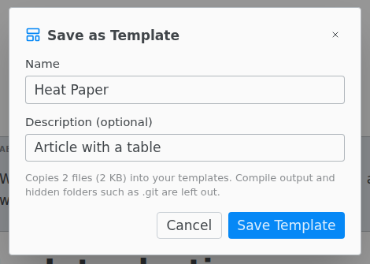

# Templates

An empty folder offers templates on its **LaTeX** and **Typst** tabs. Picking one copies its files into the folder.

## Save your own template

Set the main file, then **File › Save as Template…**. The template appears under **Your Templates** on the tab that matches the main file. Desktop app only.

The template leaves out the compiled PDF, files the build makes such as `.aux` and `.log`, build and `_draft` folders, and hidden folders such as `.git` and `.texpile`.

If the project is on GitHub or another Git server, **Save** offers **Git Remote**. That template keeps only the address: each project made from it downloads the newest version, without its history.

## Import Your Own

On the LaTeX tab, **Import Your Own** copies `.tex`, `.bib`, `.cls`, `.sty` or `.bst` files into the folder and makes the one with `\begin{document}` the main file.

## Typst templates

On the Typst tab, **Browse Typst Templates…** lists the community templates from Typst Universe. See [Typst templates](../typst/templates.md).
