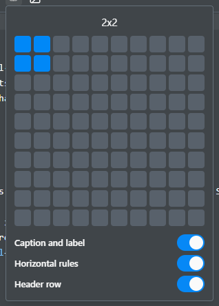
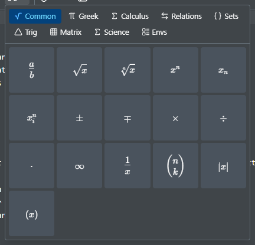

# Source editing

A code editor with syntax highlighting, showing the same document as the visual editor.

| Where to find it | Path                              | Note                            |
| ---------------- | --------------------------------- | ------------------------------- |
| In the editor    | The Visual / Source toggle        | Top right corner of the editor. |
| Setting          | File › Preferences… › Keybindings | Default, Vim, or Emacs.         |

- Keybindings: default, Vim, or Emacs, in Preferences.
- Multiple cursors: Ctrl+Alt+Up and Ctrl+Alt+Down add one, Ctrl+D selects the next occurrence.
- Equations preview as you type them, using your own macros. Esc hides the preview, and Preferences › Math preview turns it off.
- F12, or Ctrl+Click, goes to where a macro, label, or citation is defined, across files.
- The toolbar has the formatting commands, a table inserter, and a math symbol palette.

 

[All keyboard shortcuts](shortcuts.md)
