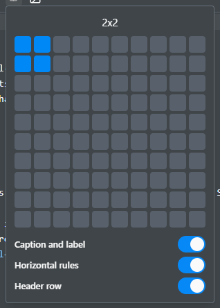
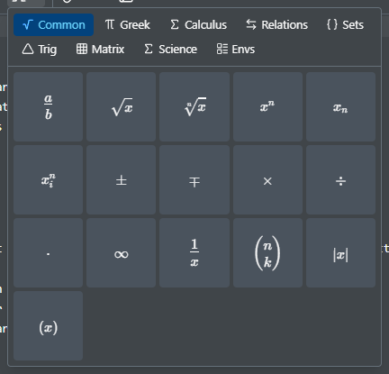

# Source editing

A code editor with syntax highlighting, showing the same document as the visual editor.

| Where to find it | Path                              | Note                            |
| ---------------- | --------------------------------- | ------------------------------- |
| In the editor    | The Visual / Source toggle        | Top right corner of the editor. |
| Setting          | File › Preferences… › Keybindings | Default, Vim, or Emacs.         |

- Keybindings: default, Vim, or Emacs, in Preferences.
- Multiple cursors: Ctrl+Alt+Up and Ctrl+Alt+Down add one, Ctrl+D selects the next occurrence.
- Equations preview as you type them, using your own macros. Esc hides the preview, and Preferences › Math preview turns it off.
- F12, or Ctrl+Click, goes to where a macro, label, or citation is defined, across files.
- The toolbar has the formatting commands, a table inserter, and a math symbol palette. In a .typ file its Ω button opens the Typst symbol picker instead, which searches every Typst symbol by name, meaning, or shorthand. See [Typst symbols](typst/README.md#symbols). In a .tex file the palette ends in More Symbols…, which opens the LaTeX symbol picker. See [LaTeX symbols](latex/README.md#symbols).

## Pasting

A paste is plain text, except where what it should become is clear:

- A range copied from a spreadsheet, such as Excel or Google Sheets, becomes a table in the file's language. Tab-separated text from anywhere else goes in as written, with the table offered.
- A URL pasted over selected words links them: `\href` in LaTeX, `#link` in Typst, `[words](url)` in Markdown.
- A picture, such as a screenshot, is saved into the project's images folder and inserted as `\includegraphics`, `#image`, or ``.

When a paste could have gone another way, a small Paste As button appears at its end. It offers the other choices: Paste as Plain Text after a table or link, Paste as Table after tab-separated text, or Paste as LaTeX (or Typst, or Markdown) after text from a web page, a document, or an AI chat, which writes its headings, lists, links, and emphasis as source. The button goes away once you edit the text or move the caret out of it. Ctrl+Z after a table or link also leaves the plain text, and a second Ctrl+Z removes the paste.

In a .tex file, a pasted link or picture that needs a package your preamble lacks offers Add to Preamble, as the symbol picker does.

- Ctrl+Shift+V, or Paste Without Formatting in the right-click menu, always pastes the plain text.
- Paste As… in the command palette shows the same choices before you paste.
- Preferences › Editor › Smart paste turns the conversions and the button off.

 

[All keyboard shortcuts](shortcuts.md)
