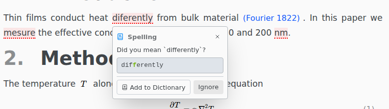

# Spell check

Texpile underlines spelling and grammar problems in English. Math, code, commands and `.bib` files are skipped. Turn it on in File › Preferences… › Spelling.

Click an underlined word for suggestions. F8 and Shift F8 jump to the next and previous problem.

A grammar problem offers **Turn Off Rule** instead of Add to Dictionary. It stops that rule in every file. Preferences › Spelling turns it back on, and holds the English variant and your dictionary.
