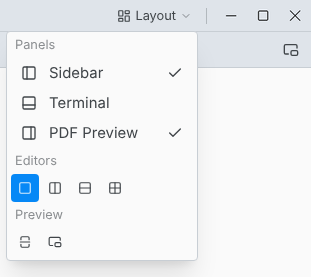
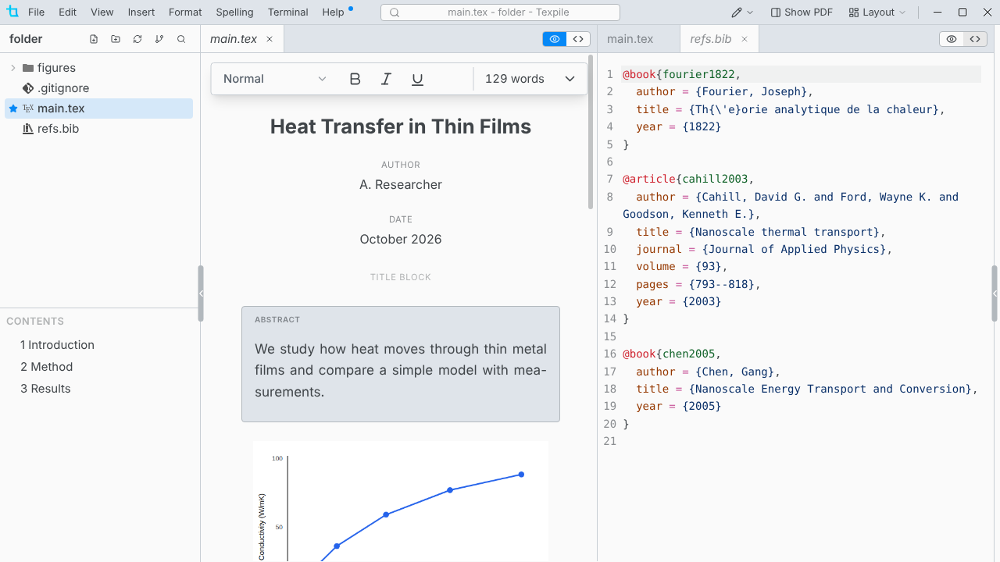
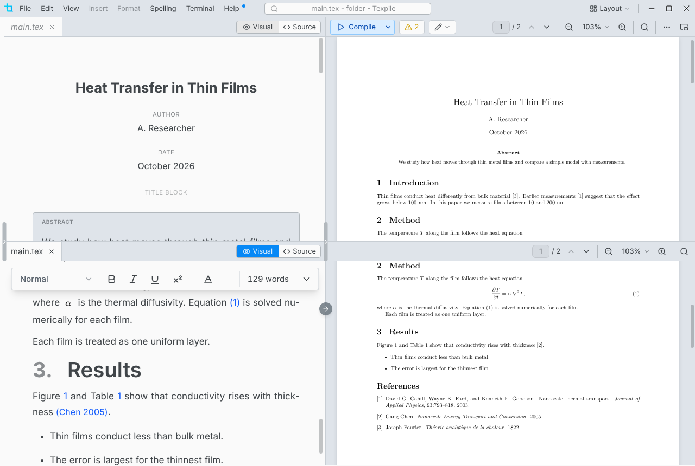

# Split view

Layout in the title bar arranges the editors and the PDF.

## Editors

Layout › **Editors** shows one editor, two side by side, two stacked, or four in a grid.

- Each editor has its own tabs and its own Visual / Source switch.
- The file tree and the command palette open files in the editor you last clicked.
- Drag a tab to the edge of an editor to split it there, or onto another editor's tabs to move it. Drop a file from the file tree onto an editor to open it there.
- A file can be open in two editors at once. What you type in one shows in the other.
- Closing an editor's last tab closes the editor.
- Texpile remembers the editors and their tabs for each folder.

## A file in its own window

Drag a tab out of the window, or right-click it › **Move into New Window**, to edit the file in a window of its own.

## The PDF in two views

Layout › **Split the preview** shows the PDF twice, one view above the other, each with its own bar. Drag the line between them to resize.

- With two editors stacked, each one's jumps to the PDF go to the view beside it.
- Only a compiled PDF splits. Live mode and the Typst preview show one view.

## The preview in its own window

Layout › **Open preview in its own window** moves the PDF out of the main window, for a second screen. Choose it again, or close that window, to bring the PDF back.
