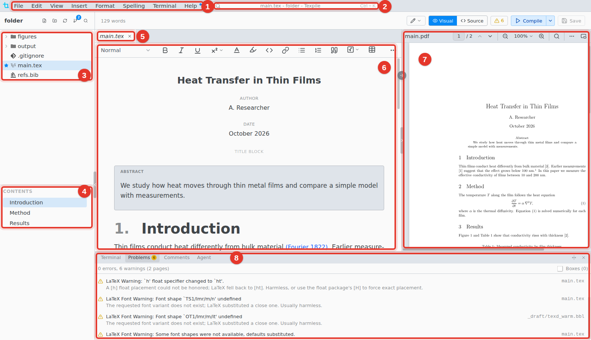
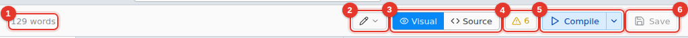
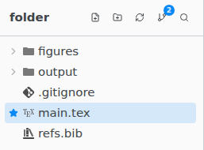
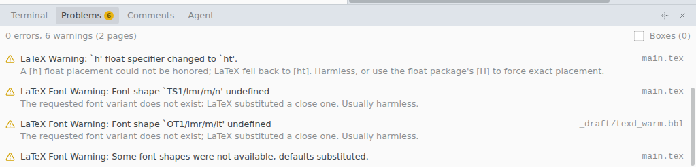

# A tour of the window

A LaTeX project, with the PDF and the bottom panel open.

1. **Menus.** On macOS they are in the system menu bar, with a Texpile menu added.
2. **Window title.** Click it, or press Ctrl K, for the [command palette](command-palette.md).
3. **Files.** The project folder. The star marks the main file.
4. **Contents.** The headings of the open file. Click one to go there.
5. **Tabs.** Ctrl Shift T reopens the last closed tab.
6. **Editor.** The visual editor, or the source editor.
7. **PDF.** The bar on the editor's right edge shows and hides it.
8. **Bottom panel.** Terminal › Show Terminal opens it.

## Top bar

1. **Word count.** Select text to count the selection. Hover for the whole paper.
2. **Editing / Suggesting.** In Suggesting, your edits become suggestions others can accept.
3. **Visual / Source.** Switch editors.
4. **Problems.** Errors and warnings from the last compile.
5. **Compile.** The menu beside it has the compile settings.
6. **Save.**

## Sidebar

The number on the Source Control button is how many files changed. Esc returns from Source Control or Find in Files to the files.

## Bottom panel

The Agent tab is a chat with an AI agent on your computer. It is hidden when every agent is turned off in Preferences › AI Assistant.

## Menus

| Menu     | What is in it                                                                                                            |
| -------- | ------------------------------------------------------------------------------------------------------------------------ |
| File     | New, Open Folder, Clone Repository…, New Window, Save, Save as Template…, Version History…, Shared Session, Preferences… |
| Edit     | Command Palette, Go to File, Undo, Redo, Find…                                                                           |
| View     | Zoom In, Zoom Out, Reset Zoom                                                                                            |
| Insert   | Math, Image…, Table, Link…, References, Symbol…, and the rest for your file type                                         |
| Format   | Bold, Italic, Underline, Text Style, Headings, Block Quote, Format Document                                              |
| Spelling | Check Spelling & Grammar, Edit Dictionary…, Spelling and Grammar Settings…                                               |
| Terminal | Compile, Configure Compile Command…, New Terminal, Show Terminal                                                         |
| Help     | Keyboard Shortcuts, Open Tutorial, What's New, Documentation, Check for Updates                                          |
