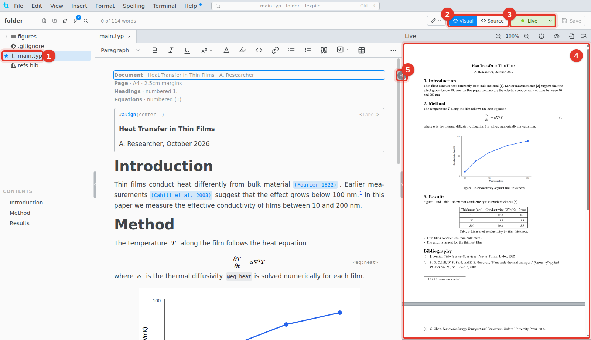

# Typst

Write Typst in the visual editor or as source, and watch the preview update as you type.

1. **Main file.** The star marks the file Texpile previews and compiles.
2. **Visual / Source.** Switch editors at any time. Both edit the same file.
3. **Live.** The preview is on. Click it to close the preview.
4. **Preview.** The document as it prints, updated as you type.
5. **Jump to preview.** Shows the cursor's place in the preview. Click the preview to jump back.

## The main file

The preview always shows the main file, not the file you have open. In a folder with several `.typ` files, Texpile asks once which one it is. To change it, right-click a file and choose **Set as Main File**.
