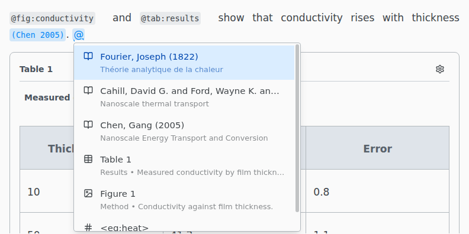

# Citations and references

Type @ to cite a work or to reference a figure, table, equation or heading.

The list holds the entries of the `.bib` or `.yml` file your `#bibliography` names, and everything with a label. Type part of a key, author, title or year to narrow it.

## Edit a citation

Click a citation to change the work or add a page number, written as `@key[p. 7]`. **Citation style** offers Automatic, In-text, Author only, Year only and Full reference.

A reference to a label shows the label itself. Click it to set the word printed before the number, such as `@sec:intro[Chapter]`.

## Your bibliography

Open a `.bib` file to edit it as a list of entries. See [Citations and references](../latex/citations.md#your-bibliography) for the bibliography editor, [Zotero](../integrations/zotero.md) and [Cite by DOI](../integrations/cite-by-doi.md).
