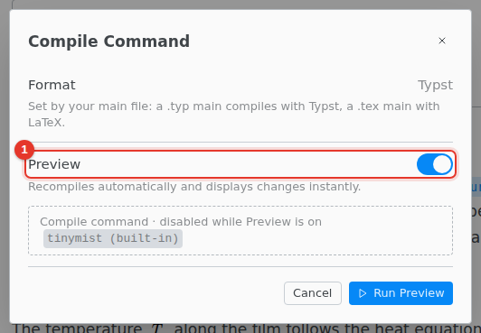

# Compiling

A Typst project shows a [live preview](live-preview.md) instead of compiling. **Show PDF** in the title bar opens it, and **Live** at the top of the preview closes it. To save a PDF, [export](export.md) the document.

## Compile to a PDF file instead

Open the menu next to **Preview** and choose **Configure Compile Command…**.

1. Turn off **Preview**.

The button then reads **Compile**, and it saves the PDF in an `output` folder and shows it beside the editor. Clicking that PDF does not jump to the source: only the preview does.

## Problems

Errors and warnings show under the text and in the Problems tab of the bottom panel. Click a row to jump there.
