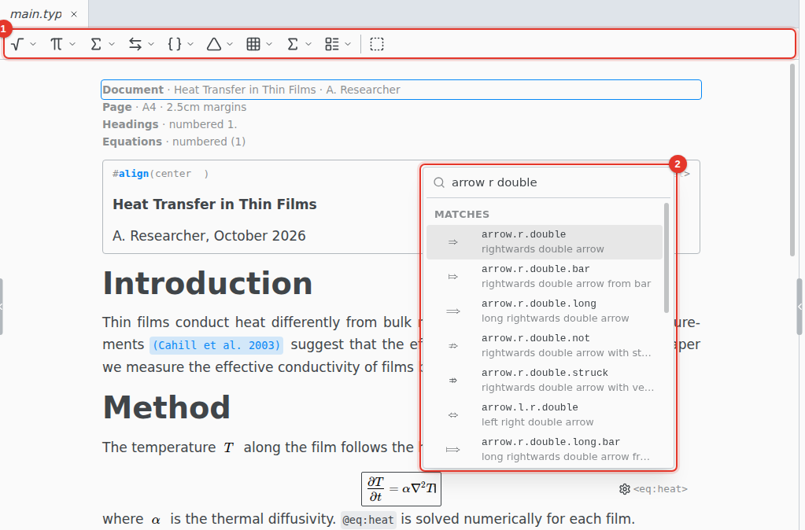
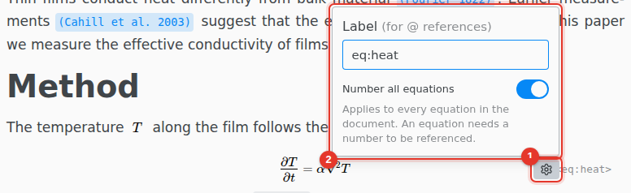

# Equations

Type math as you would in Typst and see it typeset as you go.

1. **Math toolbar.** Shows while the cursor is in an equation: roots and fractions, Greek letters, operators, arrows, brackets, accents, matrices and more.
2. **Symbol search.** Press Tab in an equation and type a name or what the symbol means, such as `arrow r double` or `not eq`.

## Insert an equation

Press Ctrl M for an inline equation, or Ctrl Shift M for a display equation.

Type a name such as `alpha` or `arrow.r` and a space, and it becomes the symbol. A name and `(`, such as `frac(`, builds a fraction with places to fill. Esc opens a box to type the Typst directly.

## Number and label

1. Hover a display equation and click its settings icon.
2. Give it a **Label**, and turn on **Number all equations**.

The switch applies to every equation in the document. A reference to an equation needs the numbering on. Type @ anywhere to reference it.

## Keyboard shortcuts

On macOS, use Cmd for Ctrl.

| Shortcut     | Action                                      |
| ------------ | ------------------------------------------- |
| Ctrl M       | Inline equation                             |
| Ctrl Shift M | Display equation                            |
| Tab          | Symbol search, inside an equation           |
| Esc          | Type the Typst directly, inside an equation |
| Shift Enter  | A new equation below, inside a display one  |
