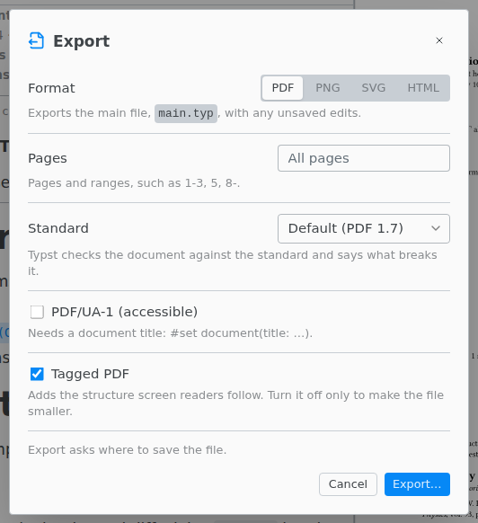

# Export

Save the main document as a file: File › Export…, or the Export button in the preview.

| Format | Options                                                                                                                  |
| ------ | ------------------------------------------------------------------------------------------------------------------------ |
| PDF    | Pages, a standard such as PDF/A-2b, PDF/UA-1 for accessibility, and Tagged PDF.                                          |
| PNG    | Pages, the resolution in PPI (300 suits print), one image or one file per page, and a transparent or colored background. |
| SVG    | Pages, and one image or one file per page.                                                                               |
| HTML   | Typst's experimental HTML export, for the whole document.                                                                |

Pages take ranges such as `1-3, 5, 8-`. Empty means all pages. PDF/UA-1 needs a document title: `#set document(title: [...])`.
