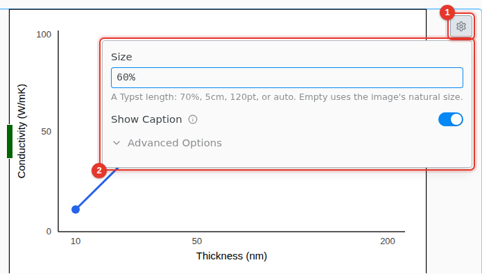

# Figures and images

Drag an image onto the editor, paste one, or use Insert › Image…. A pasted picture is saved in an `images` folder next to the file.

1. Select the image and click its settings icon.
2. Set the **Size** as a Typst length, such as `70%` or `5cm`, and turn on **Show Caption**.

The label is under **Advanced Options**. An image you give a label becomes a figure, because Typst references figures only.
