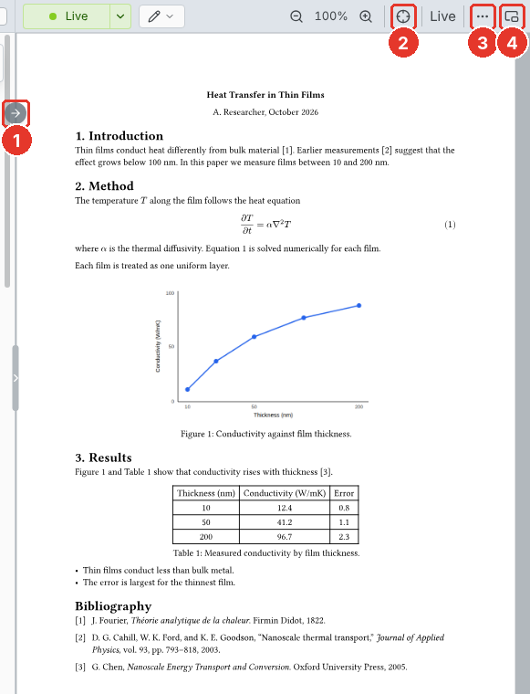

# Live preview

The preview renders the main file as you type, in the visual and the source editor. It is on by default.

1. **Jump to preview.** Shows the cursor's place in the preview. Click the preview to jump back to the source.
2. **Follow.** Keeps the preview on the cursor as you type.
3. **"…".** **Export as PDF, PNG, SVG, or HTML…** saves the document. See [Export](export.md).
4. **Own window.** Moves the preview to a window of its own.

The preview shows the main file, even when another file is open.
