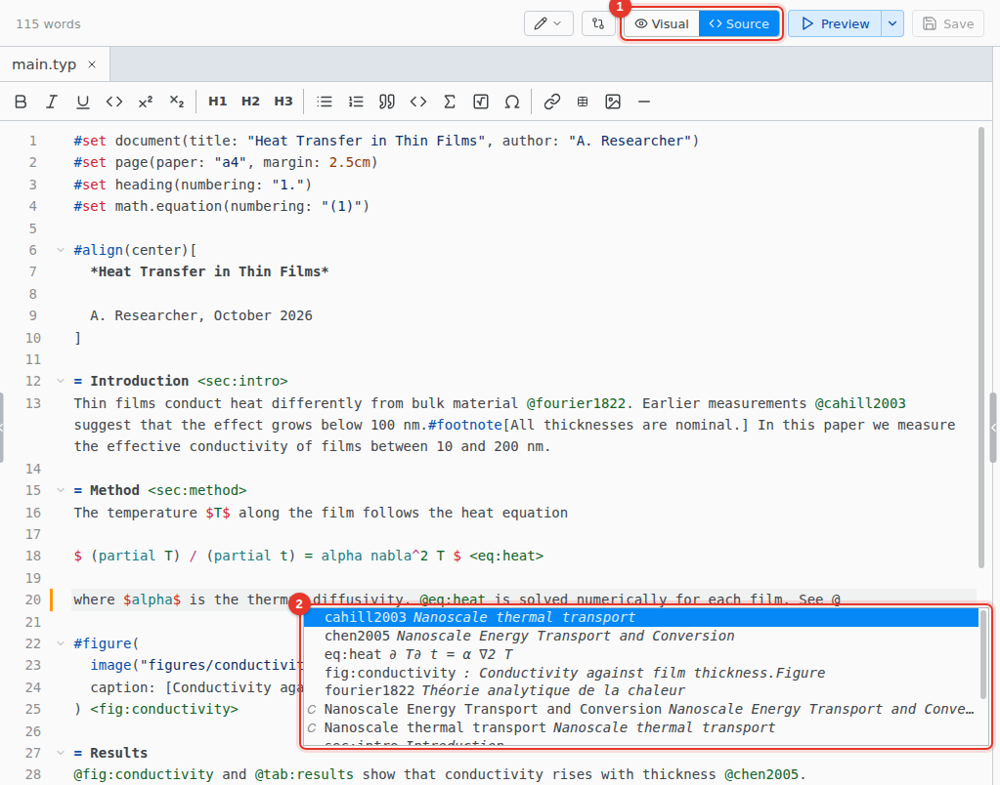

# Source editor

Edit the Typst directly. Functions, labels, citation keys and file paths complete from your whole project.

1. **Source.** Switch to the source editor.
2. **Completion.** Opens as you type. Ctrl Space opens it any time.

Hover a name to see what it is, or, inside a function call, its arguments. The swatch beside a color opens a color picker. The Ω button on the toolbar finds a symbol by name or meaning.

## Go to definition, rename and fixes

| Shortcut   | Action                                                                                  |
| ---------- | --------------------------------------------------------------------------------------- |
| F12        | Go to where a name, label or function is defined, or open the file a path names         |
| F2         | Rename a name, label or function in every file. Ctrl Z undoes it in the open file only. |
| Alt Enter  | Quick fixes where an error or hint is, such as creating a missing file                  |
| Ctrl Space | Show suggestions                                                                        |

## Format Document

Format › Format Document (typstyle)… tidies the whole file. It works in the source editor only.

## Keyboard shortcuts

On macOS, use Cmd for Ctrl. Select text first to wrap it.

| Shortcut      | Action                                        |
| ------------- | --------------------------------------------- |
| Ctrl B        | `*bold*`                                      |
| Ctrl I        | `_italic_`                                    |
| Ctrl U        | `#underline[]`                                |
| Ctrl .        | `#super[]`                                    |
| Ctrl Shift ,  | `#sub[]`                                      |
| Ctrl M        | `$ $`                                         |
| Ctrl Alt 1    | `=` heading, with 2 to 6 for the levels below |
| Ctrl D        | Select the next match                         |
| Ctrl Alt Up   | Add a cursor above                            |
| Ctrl Alt Down | Add a cursor below                            |
