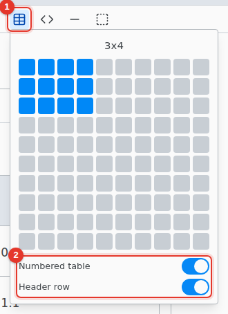
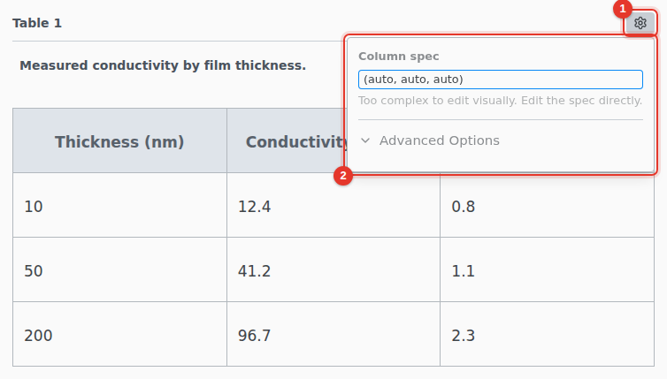

# Tables

Insert a table from the toolbar (under the arrow at its end) and edit it like a table in a word processor.

1. **Insert table.** Move over the grid to pick a size, up to 10 by 10.
2. **Numbered table** puts the table in a figure with a caption you can reference. **Header row** repeats the first row on each page. Decide before inserting.

## Edit

Tab moves to the next cell. Right-click a cell to add or delete rows and columns. Select several cells and right-click › **Merge Cells**. Drag the border between two columns to change its width.

A range copied from a spreadsheet pastes as a table.

## Table settings

1. Hover the table and click its settings icon.
2. Edit the **Column spec** as Typst, such as `(auto, 1fr, auto)`. The label is under **Advanced Options**.
