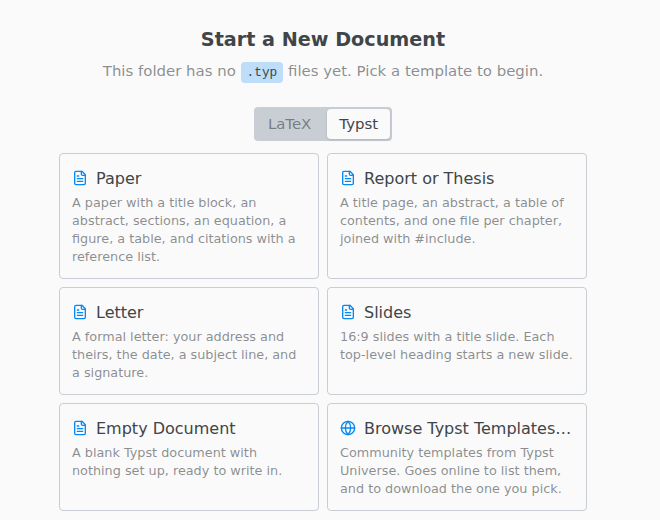

# Templates

Open an empty folder and pick a template on the Typst tab.

The built-in templates keep their layout in `template.typ`, so `main.typ` holds only your text.

**Browse Typst Templates…** lists the community templates from Typst Universe. It goes online to list them and to download the one you pick.

To reuse a project of your own, save it with File › Save as Template…. It then appears under Your Templates.
