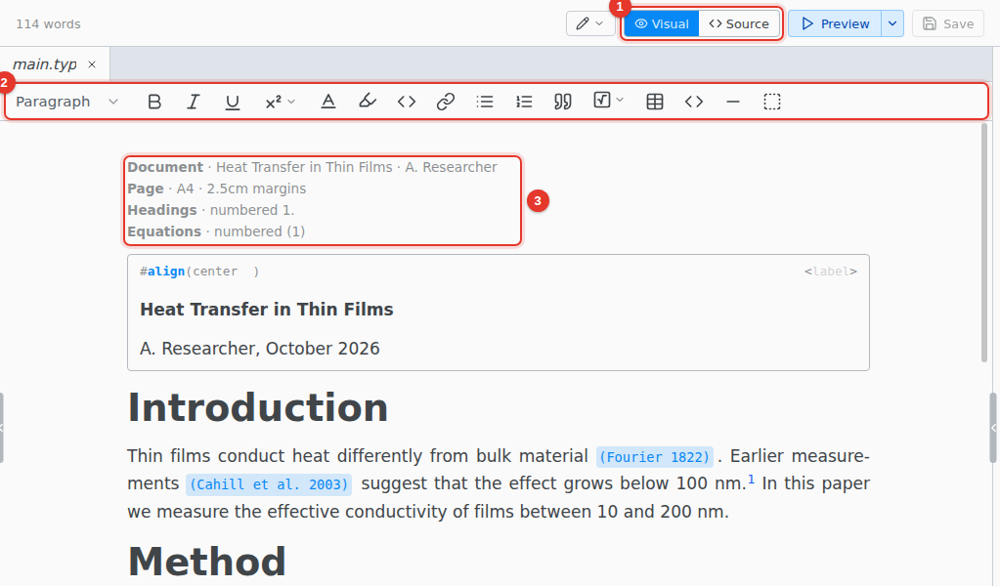
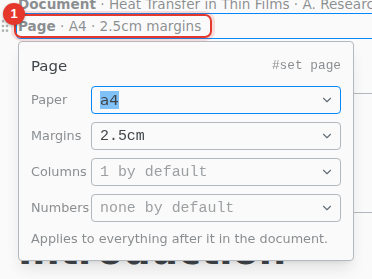
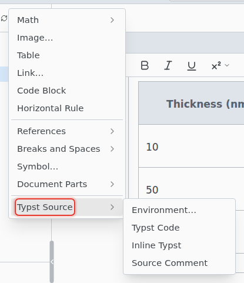

# Visual editor

Edit the document as formatted text. Texpile writes the Typst, and the parts you do not touch stay exactly as they were.

1. **Visual / Source.** Switch at any time. Undo works across the switch.
2. **Toolbar.** Headings, text style, lists, math, tables and code. The Insert and Format menus have the rest.
3. **Set rules.** Each shows as one line. Click it to change it.

A reference shows its label, not its number. Click a reference, a label or a code chip to edit it.

The visual editor cannot open files over 800 KB. They open in the source editor.

## Set rules

The panel has the common settings for the page, text, paragraphs, headings, the document and equations. Anything else the rule sets is kept as written.

## Add your own function

Insert › Typst Source has the parts the toolbar does not.

- **Environment…** wraps content in a function, such as `theorem` or `block`. Functions you define with `#let` are offered first.
- **Typst Code** and **Inline Typst** add raw Typst as a block or inside a line.

Anything the editor cannot show stays as a Typst code chip. Click it to edit it.

## Paste

Paste from Word, a spreadsheet, a web page or a screenshot, and Texpile keeps what it can. Math copied from a LaTeX file pastes as Typst math. See [Paste and drop](../paste.md).

## Keyboard shortcuts

On macOS, use Cmd for Ctrl. Typing `=` and a space at the start of a line also starts a heading.

| Shortcut     | Action           |
| ------------ | ---------------- |
| Ctrl Alt 1   | Heading 1        |
| Ctrl Alt 2   | Heading 2        |
| Ctrl Alt 3   | Heading 3        |
| Ctrl Alt 0   | Normal text      |
| Ctrl M       | Inline equation  |
| Ctrl Shift M | Display equation |
| Ctrl .       | Superscript      |
| Ctrl Shift , | Subscript        |
| Ctrl Shift B | Quote            |
| Ctrl Shift ` | Code block       |
