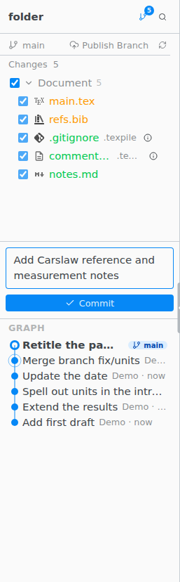

# Version control

**Source Control** commits your work with git when you choose. [Version History](local-history.md) keeps a copy of each file on every save, with or without git.

> [!REQUIRES] [git](../installation/git.md), for Source Control

`Ctrl Shift G` opens Source Control (Ctrl on macOS too, not Cmd).

## Commit

- Files the build makes, such as `.aux` and `.log`, are listed under **Build** and left out of commits. **Add to .gitignore** on the group tells git to ignore them for good. Your PDF is not in this group.
- A file you untick stays out of commits until it has no changes, even after a restart.
- Files under `.texpile/` show **Managed by Texpile**. Do not edit them by hand.
- If git has no name and email yet, the first commit asks for them and saves them for every project on this computer.
- **Discard Changes** keeps a copy in Version History first and offers **Undo**. A new file that was never committed goes to the Trash.

## Sync

**Sync** brings in the commits made elsewhere, then sends yours. If uncommitted changes block it, **Commit & Sync** commits them first. Switching branches with **Checkout to…** in the [command palette](../command-palette.md) offers **Commit & Checkout** the same way.

While the window is in front, Texpile checks for new commits every 3 minutes, without asking you to sign in.

When both sides changed the same lines, see [Merge conflicts](conflicts.md).

## Clone

**File › Clone Repository…** takes a clone URL, the repository's web page on GitHub, GitLab or Bitbucket, a `git clone` command copied from a README, or an Overleaf project page.

## Not available

Use git in the [terminal](../build-and-preview/terminal.md) to create, rename, delete or merge branches, stash, rebase, cherry-pick, tag, blame, amend a commit, stage part of a file, or manage submodules and Git LFS files.
