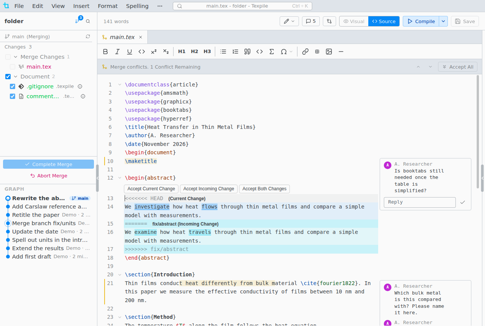

# Merge conflicts

When Sync finds that both sides changed the same lines, choose **Merge** and resolve each file under **Merge Changes** in the source editor.

- The visual editor is off for a file until its conflicts are resolved.
- Pick a side with the buttons above each conflict, or edit the lines yourself. A conflict is resolved when its `<<<<<<<`, `=======` and `>>>>>>>` lines are gone.
- A conflict over a deleted file, or a file that is not text such as an image, is listed in Source Control instead. Click it to keep one version.

## Finish or abort

**Complete Merge** makes the merge commit. **Sync Changes** then pushes it. **Abort Merge** drops the merge, and the conflicts you resolved are lost.
