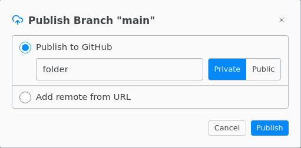

# GitHub and other remotes

Make your first commit, then choose **Publish Branch** in the Source Control header.

**Publish to GitHub** creates a new repository and pushes over HTTPS. **Add remote from URL** pushes to an existing empty repository on any host, such as GitLab, Bitbucket or Codeberg.

## Sign in

- **Sign In to GitHub** in the command palette signs in to github.com through your browser.
- Otherwise Texpile uses the sign-in git already has on this computer, such as a saved password or an SSH key, and asks only when there is none. For GitHub the password is a personal access token with the `repo` scope.
- A username and password that work are saved in your system keychain. **Forget Saved Git Credentials** in the command palette removes them.
