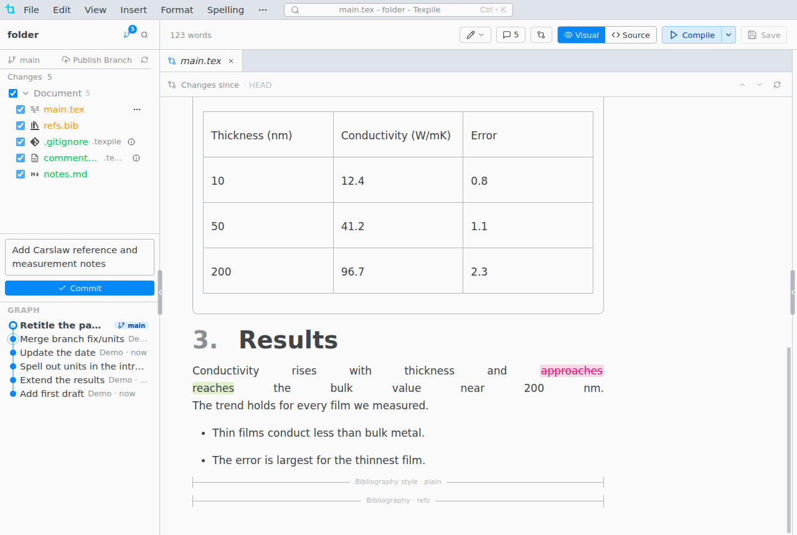
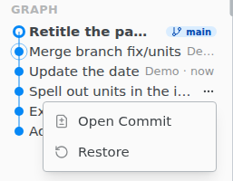

# Diffs and the Graph

Click a changed file in Source Control, or **Open Changes** in the top bar, to see what changed since the last commit. The visual editor marks changes word by word, the source editor line by line.

- **Revert Change** beside a change puts back only that change.
- `Alt F5` and `Shift Alt F5` go to the next and previous change, on macOS too.
- In the source editor the margin marks added (green), changed (orange) and removed (red wedge) lines. Click a mark to see the old lines and revert them.

## The Graph

The commits, newest first, below the changes list. Click a commit to compare it with your files.

**Restore** brings the whole project back to that commit, as a new commit you can undo. Uncommitted changes are committed first.

For the saved copies of a single file, see [Version History](local-history.md).
