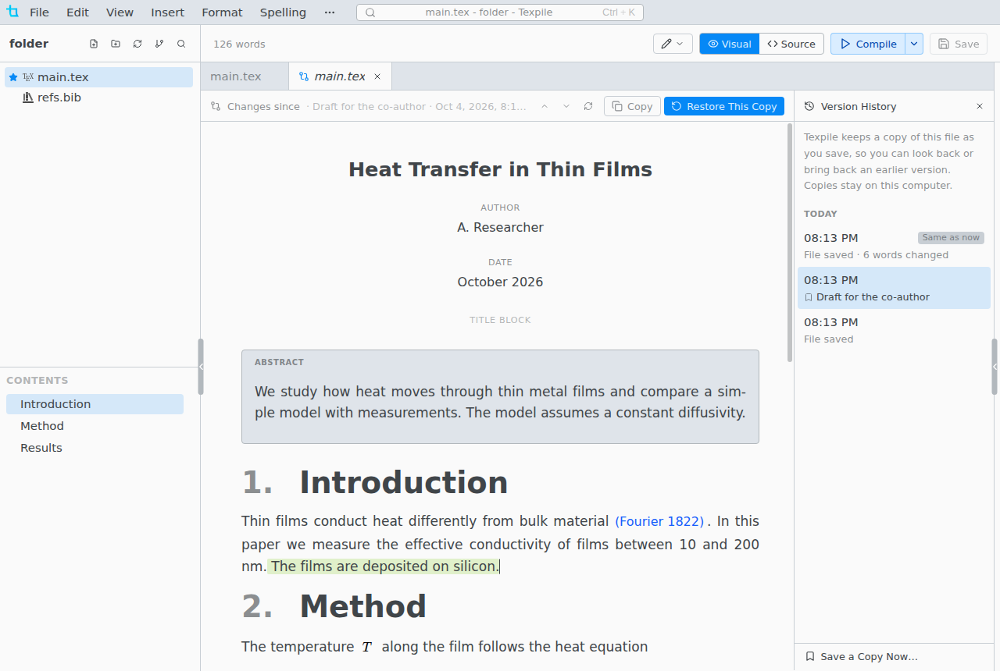

# Version History

Texpile keeps a copy of each file every time you save, in every project, with or without git. **File › Version History…**, or right-click a file or tab.

- The copies stay on this computer, in Texpile's data folder. They do not travel with the project.
- A copy is also kept before **Discard Changes**, before a restore, and before a file changed outside Texpile replaces your unsaved edits.
- **Save a Copy Now…** keeps a copy under a name you choose. Named copies are kept until you delete them.
- **Restore This Copy** first keeps a copy of the file as it is now, and offers **Undo**. It rejects suggestions made since that copy. **Undo** brings them back.

## Restore a deleted file

**File › Restore Deleted File…**, or right-click a folder for that folder only. The folder comes back too if it is gone.

## Limits

Files over 1 MB get no copies. Older copies thin out over 30 days: see [Limits](../reference/limits.md#version-history). In a shared session the host keeps the copies, guests' edits included.
